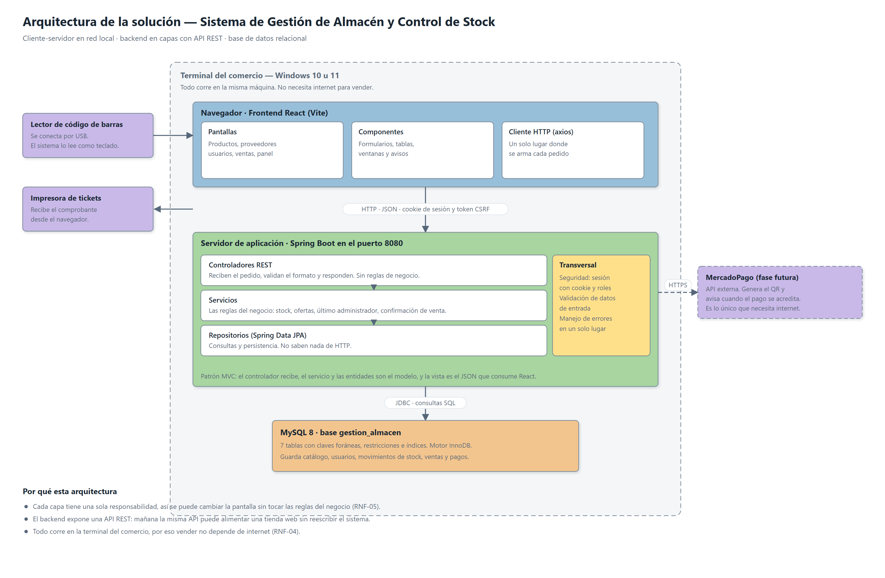

# 2. Arquitectura de la solución

## 2.1 Tipo de arquitectura

El sistema es **cliente-servidor**, con el backend organizado **en capas** y comunicación por una
**API REST**.

- **Cliente-servidor**, porque el comercio necesita una pantalla de venta rápida y una base de
  datos única. El navegador muestra y pide; el servidor decide y guarda.
- **En capas**, porque las reglas del negocio no pueden estar repartidas entre las pantallas. Si el
  descuento de stock viviera en el frontend, cualquier cambio de pantalla podría romperlo.
- **API REST**, porque desacopla al cliente del servidor. La misma API que hoy usa React puede
  alimentar mañana una tienda web o una aplicación móvil sin reescribir el backend.

Sobre el patrón MVC: se aplica en el backend. El controlador recibe el pedido, el modelo son las
entidades y los servicios que aplican las reglas, y la vista es la respuesta JSON. React no es "la
V" del MVC del servidor, es un cliente que consume esa vista.

## 2.2 Componentes

| Componente | Responsabilidad | Tecnología |
|---|---|---|
| Interfaz de usuario | Pantallas, formularios y validación de forma | React + Vite |
| Cliente HTTP | Arma los pedidos y traduce los errores del servidor | axios |
| Controladores REST | Reciben el pedido, validan el formato, eligen el código de respuesta | Spring MVC |
| Servicios | Reglas del negocio | Spring (capa propia) |
| Repositorios | Consultas y persistencia | Spring Data JPA |
| Base de datos | Almacenamiento e integridad | MySQL 8 |
| Seguridad | Autenticación, sesión y permisos | Spring Security |

Cada capa habla solo con la de abajo. Un controlador nunca consulta la base directamente, y un
repositorio no sabe que existe HTTP.

## 2.3 Comunicación entre las partes

**Navegador y backend.** HTTP con cuerpos JSON. El navegador manda la cookie de sesión en cada
pedido. En las operaciones que modifican datos agrega además el token CSRF.

**Backend y base de datos.** JPA sobre JDBC. Las consultas se escriben en JPQL o se derivan del
nombre del método del repositorio. No hay SQL armado concatenando texto, así que no hay lugar para
inyección de SQL.

**Lector de código de barras.** Se conecta por USB y el sistema operativo lo trata como un teclado.
Para el sistema es texto escrito en el campo de búsqueda, seguido de Enter. No necesita driver.

**MercadoPago.** HTTPS contra su API, solo cuando se elige ese método de pago. Es lo único del
sistema que depende de internet.

## 2.4 Diseño de la API

Un recurso por entidad y el método HTTP indica la operación.

| Método | Ruta | Operación |
|---|---|---|
| GET | `/api/products` | Listar y buscar |
| GET | `/api/products/{id}` | Consultar uno |
| POST | `/api/products` | Crear |
| PUT | `/api/products/{id}` | Modificar |
| PATCH | `/api/products/{id}/deactivate` | Dar de baja |
| PATCH | `/api/products/{id}/activate` | Reactivar |

No hay `DELETE`: el sistema no borra registros, los da de baja. Así se conserva el historial que
los referencia.

El stock tiene su propio recurso, `/api/stock`, porque no se modifica como un dato más del
producto: cada cambio pasa por un ajuste con motivo, que deja su movimiento registrado. Ahí mismo
se consultan los movimientos y las alertas.

Convenciones que se repiten en todos los recursos:

- Los códigos de respuesta se usan por su significado: 200 y 201 para las operaciones que salieron
  bien, 400 cuando los datos vienen mal, 401 cuando no hay sesión, 403 cuando el rol no alcanza,
  404 cuando el recurso no existe y 409 cuando la operación rompe una regla del negocio.
- Lo que entra es un objeto de transferencia (DTO) con solo los campos que el cliente puede mandar.
  Así nadie puede alterar el id, la fecha de alta ni el estado de un registro.
- Lo que sale es la entidad. La contraseña nunca sale: el campo está marcado para que quede
  excluido de toda respuesta.
- Los errores tienen siempre la misma forma: un mensaje para mostrar y, cuando corresponde, el
  detalle campo por campo.

El detalle de cada endpoint está en `06-api-rest.md`.

## 2.5 Autenticación y autorización

**Autenticación con sesión y cookie.** Al iniciar sesión, el servidor verifica la contraseña contra
su hash y guarda la sesión. El navegador recibe una cookie marcada como `HttpOnly`, que ningún
script puede leer.

Se evaluó usar un token JWT guardado en el navegador. Se descartó por dos motivos: el sistema corre
en una terminal dentro del comercio, no en varios servidores donde el token evita consultar la
sesión; y con un token en JavaScript, cerrar sesión no invalida nada del lado del servidor, mientras
que con sesión sí.

**Autorización por rol.** Dos roles fijos. El Empleado accede a ventas, productos, stock,
proveedores y alertas. El Administrador agrega usuarios, historial, precios y ofertas. La
restricción se aplica en el servidor. El frontend además esconde las opciones que el rol no puede
usar, pero eso es comodidad, no seguridad: quien llame directamente a la API sin permisos recibe un
403.

## 2.6 Seguridad

| Riesgo | Cómo se trata |
|---|---|
| Contraseñas expuestas | Se guardan hasheadas con BCrypt. El hash nunca sale por la API |
| Credenciales en el código | La conexión a la base se configura en un archivo local que Git ignora |
| Robo de la cookie desde el navegador | Cookie `HttpOnly` y `SameSite=Lax` |
| Peticiones falsificadas desde otro sitio (CSRF) | Token que el cliente debe devolver en cada operación de escritura |
| Inyección de SQL | Consultas con parámetros, nunca armadas concatenando texto |
| Filtración de detalles internos | Ante un error inesperado se devuelve un mensaje genérico y el detalle queda en el log |
| Datos inválidos | Validación en el DTO, reglas en el servicio y restricciones en la base |

## 2.7 Validación y manejo de errores

La validación ocurre en tres lugares, y cada uno atrapa algo distinto:

1. **El formulario** avisa lo obvio antes de mandar el pedido.
2. **El DTO** valida formato y obligatoriedad. Si algo falla, el pedido ni entra al método.
3. **El servicio** aplica las reglas del negocio: código de barras repetido, oferta más cara que el
   precio, borrar el único administrador.
4. **La base** rechaza lo que igual no debería entrar: stock negativo, cantidad en cero, un rol que
   no existe.

Los errores se traducen a JSON en un único lugar del backend. Los controladores no tienen bloques
`try/catch`: cada uno se ocupa solo del camino correcto.

## 2.8 Escalabilidad y mantenimiento

El sistema está pensado para un comercio, no para miles de usuarios concurrentes. Igual quedan
abiertas estas puertas:

- Los listados pueden paginarse sin cambiar el contrato de la API.
- La base admite más carga con índices y, si hiciera falta, con réplicas de lectura.
- La API REST permite sumar clientes nuevos sin tocar el backend.
- Se puede mover el backend a un servidor de la red y dejar varias terminales trabajando contra él.

Para el mantenimiento: cada componente tiene una responsabilidad, el código se comenta donde la
decisión no es evidente, y el trabajo se versiona en ramas por funcionalidad.

## 2.9 Atributos de calidad

| Atributo | Cómo lo favorece la arquitectura |
|---|---|
| Rendimiento (RNF-01) | Índices en las columnas de búsqueda; el frontend no recalcula lo que ya resolvió el servidor |
| Seguridad (RNF-02) | Sesión con cookie `HttpOnly`, contraseñas hasheadas, permisos aplicados en el servidor |
| Usabilidad (RNF-03) | Mensajes de error en español que el servidor manda listos para mostrar debajo de cada campo |
| Disponibilidad (RNF-04) | Todo corre en la terminal del comercio; solo el pago digital necesita internet |
| Mantenibilidad (RNF-05) | Capas con una responsabilidad cada una y dependencia hacia interfaces, no hacia clases concretas |
| Portabilidad (RNF-06) | Java y MySQL sobre Windows; el frontend se abre en cualquier navegador |

## 2.10 Convenciones de nombres

Cada parte del sistema usa el idioma que le corresponde:

- **El código, en inglés.** Clases, variables, métodos y rutas de la API: `Product`, `minimumStock`,
  `/api/products`. Es la convención del lenguaje y de las bibliotecas que se usan.
- **La base de datos, en español.** Tablas y columnas: `productos`, `stock_minimo`. Son los mismos
  nombres que usan el análisis y el diccionario de datos, así que el modelo se lee igual en los dos
  lados.
- **Lo que ve el usuario, en español.** Textos de pantalla y mensajes de error (RNF-03).

La unión entre el código y la base la hacen las anotaciones `@Table` y `@Column` de cada entidad, en
un solo lugar por campo.
