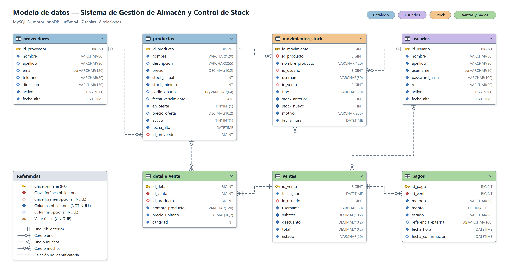

# 4. Modelo de datos

## 4.1 Modelo conceptual

Del análisis se desprenden siete entidades.

| Entidad | Qué representa |
|---|---|
| Proveedor | Quien le vende mercadería al comercio |
| Producto | Cada artículo del catálogo, con su precio y su stock |
| Usuario | Quien usa el sistema, con su rol |
| Movimiento de stock | Cada cambio de stock de un producto, con su motivo |
| Venta | Una operación de venta cerrada, con su total |
| Detalle de venta | Cada renglón de una venta: qué producto, cuántas unidades y a qué precio |
| Pago | Cómo se pagó una venta y en qué estado quedó |

Las relaciones entre ellas:

| Relación | Cardinalidad | Lectura |
|---|---|---|
| Proveedor – Producto | 1 a N (opcional) | Un proveedor provee muchos productos. Un producto puede no tener proveedor |
| Venta – Detalle | 1 a N | Una venta tiene al menos un renglón. Un renglón pertenece a una sola venta |
| Producto – Detalle | 1 a N (opcional) | Un producto aparece en muchos renglones. Un renglón puede quedar sin producto si el producto se borra |
| Venta – Pago | 1 a N | Una venta puede tener más de un intento de pago. Solo uno queda aprobado |
| Usuario – Venta | 1 a N (opcional) | Un usuario hace muchas ventas. La venta sobrevive aunque el usuario se borre |
| Producto – Movimiento | 1 a N (opcional) | Cada producto acumula sus movimientos de stock |
| Usuario – Movimiento | 1 a N (opcional) | Cada movimiento registra quién lo hizo |
| Venta – Movimiento | 1 a N (opcional) | Los movimientos originados por una venta quedan ligados a ella |

## 4.2 Diagrama entidad-relación



La llave amarilla marca la clave primaria. El rombo rojo marca una clave foránea: lleno cuando es
obligatoria, hueco cuando admite nulo. Los rombos azules son el resto de las columnas, con el mismo
criterio. La pata de gallo señala el lado "muchos" de cada relación y el círculo indica que puede no
haber ninguno.

## 4.3 Decisiones de diseño

### El dinero se guarda en DECIMAL, nunca en coma flotante

`precio`, `precio_unitario` y `total` son `DECIMAL(10,2)`. Los tipos `FLOAT` y `DOUBLE` guardan los
números en binario y no pueden representar exactamente valores como 0,10. El error es mínimo en un
número suelto, pero se acumula al sumar un carrito y termina en un total que no cierra contra lo que
se cobró.

### El detalle de la venta guarda una copia del nombre y del precio

`detalle_venta` no se limita a apuntar al producto: copia el nombre y el precio que tenía en el
momento de la venta.

El precio de un producto cambia (CU-20). Si el ticket se armara uniendo con la tabla `productos`, un
comprobante de marzo mostraría el precio de hoy. Sería incorrecto y no habría forma de auditar
cuánto se cobró en realidad.

Como consecuencia, borrar un producto deja de ser peligroso: la clave foránea queda en nulo y el
renglón se sigue leyendo entero. Lo mismo hace `movimientos_stock` con el nombre del producto y el
del usuario.

### El stock se guarda en el producto y además se registra cada cambio

`productos.stock_actual` tiene el valor de hoy, para poder mostrar el catálogo con una sola consulta.
`movimientos_stock` guarda la historia: carga inicial, ajustes manuales y descuentos por venta.

Las dos cosas se mantienen consistentes porque el stock nunca se modifica sin generar su movimiento.
La consulta 10 del archivo de ejemplos verifica esa igualdad y tiene que devolver cero filas.

### Las alertas y las sugerencias no se guardan

No hay tabla de alertas. Que un producto esté por debajo del mínimo es una consulta, no un dato: se
calcula cada vez que se abre el panel. Una alerta guardada envejece mal, porque queda desactualizada
apenas cambia el stock.

Lo mismo con las sugerencias de oferta: salen de contar las ventas del período y mirar las fechas de
vencimiento.

### El ticket tampoco es una tabla

El comprobante se arma con los datos de la venta y su detalle, que son inmutables. Guardar además el
texto ya armado sería duplicar la misma información. El número de ticket es el `id_venta`.

### Los pagos van en su propia tabla

Una venta con MercadoPago puede tener más de un intento: el QR que venció y el que finalmente se
pagó (CU-10). Con una columna en `ventas` habría que pisar el dato anterior; con una tabla, queda el
rastro de los dos.

`referencia_externa` es el identificador del pago en MercadoPago y tiene restricción de unicidad. Si
MercadoPago avisa dos veces del mismo pago, la segunda notificación no puede registrarse por
duplicado.

### Los estados se guardan como texto con restricción, no como número

`rol`, `estado` y `tipo` son `VARCHAR` con una restricción `CHECK` que enumera los valores válidos.
Guardar la posición de un enumerado sería más corto, pero si mañana se agrega un valor en el medio
de la lista, los datos ya guardados pasan a significar otra cosa. Con el nombre, un `ADMIN` sigue
siendo `ADMIN` para siempre. Además la base queda legible al consultarla a mano.

### Las bajas son lógicas

Productos, proveedores y usuarios tienen `activo`. Dar de baja los oculta pero conserva la fila y,
con ella, el historial que los referencia. La aplicación no borra registros.

Las reglas de borrado de las claves foráneas, que se describen a continuación, igual están
definidas: protegen la integridad si alguna vez se borra un registro desde fuera del sistema, por
ejemplo desde MySQL Workbench.

### Cada clave foránea decide qué pasa al borrar

| Relación | Al borrar el padre | Por qué |
|---|---|---|
| `productos` → `proveedores` | El producto queda sin proveedor | El producto se sigue vendiendo aunque el proveedor ya no trabaje con el comercio |
| `detalle_venta` → `productos` | El renglón queda sin producto | El ticket ya tiene el nombre y el precio copiados |
| `detalle_venta` → `ventas` | Se borran los renglones | Un renglón no existe fuera de su venta |
| `pagos` → `ventas` | Se borran los pagos | Ídem |
| `ventas` → `usuarios` | La venta queda sin usuario | La venta ocurrió: borrar al empleado no puede borrar la facturación |
| `movimientos_stock` → todos | El movimiento queda sin la referencia | Es un registro de auditoría: tiene que sobrevivir a lo que audita |

## 4.4 Normalización

El modelo está en tercera forma normal.

- **Primera forma normal.** Todos los campos son atómicos. No hay listas dentro de una columna: los
  productos de una venta están en `detalle_venta`, un renglón por producto.
- **Segunda forma normal.** Las claves primarias son simples, de una sola columna, así que ningún
  campo puede depender de una parte de la clave.
- **Tercera forma normal.** Ningún campo depende de otro campo que no sea la clave. Los datos del
  proveedor no se repiten en cada producto: el producto guarda el identificador.

**Las copias de `detalle_venta` y de `movimientos_stock` no rompen la normalización.** El nombre del
producto en un renglón de venta no es "el nombre del producto": es el nombre con el que se vendió ese
día. Son dos datos distintos que coinciden hasta que alguien renombra el producto. Guardar el
histórico es una decisión de diseño deliberada, no una repetición por descuido.

Lo mismo vale para `ventas.total`. Se podría recalcular sumando los renglones, pero es la cifra que
se cobró y el sistema tiene que conservarla tal cual. Además permite sumar la recaudación de un
período sin recorrer el detalle.

## 4.5 Claves e índices

| Tabla | Clave primaria | Únicos | Índices |
|---|---|---|---|
| proveedores | id_proveedor | email | — |
| productos | id_producto | codigo_barras | nombre, activo |
| usuarios | id_usuario | username | — |
| ventas | id_venta | — | fecha_hora; (id_usuario, fecha_hora) |
| detalle_venta | id_detalle | — | id_producto |
| pagos | id_pago | referencia_externa | — |
| movimientos_stock | id_movimiento | — | (id_producto, fecha_hora) |

Los índices no son decorativos, cada uno responde a una consulta concreta:

- `productos.nombre` es la búsqueda más frecuente del sistema (RF-01).
- `productos.activo` filtra el catálogo, que casi siempre se pide solo con los activos.
- `ventas.fecha_hora` y la combinación con `id_usuario` sostienen los filtros del historial (RF-07).
- `detalle_venta.id_producto` permite filtrar el historial por producto y calcular la rotación.
- La combinación en `movimientos_stock` arma el historial de un producto ordenado por fecha.

MySQL crea por su cuenta un índice para cada clave foránea, así que no hace falta declararlos de
nuevo.

## 4.6 Reglas de integridad en la base

Además de lo que valida la aplicación, la base rechaza por su cuenta los datos imposibles.

| Restricción | Qué impide |
|---|---|
| `ck_productos_precio` | Un precio en cero o negativo |
| `ck_productos_stock` | Stock actual o mínimo negativos |
| `ck_productos_oferta` | Marcar un producto en oferta sin precio especial, o con un precio de oferta mayor o igual al normal |
| `ck_usuarios_rol` | Un rol que no sea ADMIN o EMPLEADO |
| `ck_ventas_estado` | Un estado de venta inventado |
| `ck_ventas_importes` | Importes negativos o un descuento mayor al subtotal |
| `ck_detalle_cantidad` | Vender cero o menos unidades |
| `ck_pagos_metodo`, `ck_pagos_estado` | Un método o un estado de pago que no existe |
| `ck_movimientos_tipo` | Un tipo de movimiento fuera de los tres previstos |
| `uq_usuarios_username` | Dos usuarios con el mismo nombre de usuario |
| `uq_proveedores_email` | Dos proveedores con el mismo correo |
| `uq_productos_codigo_barras` | Dos productos con el mismo código de barras |
| `uq_pagos_referencia` | Registrar dos veces la misma notificación de MercadoPago |

Las restricciones de unicidad admiten varios nulos. Por eso puede haber muchos productos sin código
de barras, pero no dos con el mismo.

## 4.7 Seguridad de la información

- Las contraseñas se guardan hasheadas con BCrypt, en la columna `password_hash`. No hay forma de
  recuperar la contraseña original, ni siquiera con acceso a la base.
- La API nunca devuelve ese campo.
- Las credenciales de conexión a MySQL no están en el repositorio. Se configuran en un archivo local
  que Git ignora.
- El sistema no guarda datos de tarjetas. El pago digital lo procesa MercadoPago y el sistema solo
  guarda el identificador de la operación.

## 4.8 Diccionario de datos

### proveedores

| Campo | Tipo | Nulo | Descripción |
|---|---|---|---|
| id_proveedor | BIGINT | No | Identificador. Clave primaria |
| nombre | VARCHAR(80) | No | Nombre de la persona o razón social |
| apellido | VARCHAR(80) | Sí | Vacío cuando el proveedor es una empresa |
| email | VARCHAR(120) | Sí | Correo de contacto. Único |
| telefono | VARCHAR(30) | Sí | Teléfono. Texto, para admitir prefijos y guiones |
| direccion | VARCHAR(150) | Sí | Domicilio |
| activo | TINYINT(1) | No | 1 activo, 0 dado de baja |
| fecha_alta | DATETIME | No | Cuándo se registró |

### productos

| Campo | Tipo | Nulo | Descripción |
|---|---|---|---|
| id_producto | BIGINT | No | Identificador. Clave primaria |
| nombre | VARCHAR(120) | No | Nombre del producto |
| descripcion | VARCHAR(255) | Sí | Detalle adicional |
| precio | DECIMAL(10,2) | No | Precio de venta. Mayor a cero |
| stock_actual | INT | No | Unidades disponibles |
| stock_minimo | INT | No | Umbral que dispara la alerta de stock bajo |
| codigo_barras | VARCHAR(64) | Sí | Código del envase. Único |
| fecha_vencimiento | DATE | Sí | Solo productos perecederos |
| en_oferta | TINYINT(1) | No | 1 si está en oferta |
| precio_oferta | DECIMAL(10,2) | Sí | Precio especial. Obligatorio si está en oferta y menor al normal |
| activo | TINYINT(1) | No | 1 activo, 0 dado de baja |
| fecha_alta | DATETIME | No | Cuándo se cargó |
| id_proveedor | BIGINT | Sí | Proveedor que lo provee |

### usuarios

| Campo | Tipo | Nulo | Descripción |
|---|---|---|---|
| id_usuario | BIGINT | No | Identificador. Clave primaria |
| nombre | VARCHAR(80) | No | Nombre |
| apellido | VARCHAR(80) | No | Apellido |
| username | VARCHAR(50) | No | Nombre de usuario para entrar. Único |
| password_hash | VARCHAR(100) | No | Hash BCrypt de la contraseña |
| rol | VARCHAR(20) | No | ADMIN o EMPLEADO |
| activo | TINYINT(1) | No | 1 activo. Un usuario dado de baja no puede entrar |
| fecha_alta | DATETIME | No | Cuándo se creó |

### ventas

| Campo | Tipo | Nulo | Descripción |
|---|---|---|---|
| id_venta | BIGINT | No | Identificador. También es el número de ticket |
| fecha_hora | DATETIME | No | Cuándo se hizo la venta |
| id_usuario | BIGINT | Sí | Usuario que la registró |
| username | VARCHAR(50) | No | Copia del nombre de usuario al momento de la venta |
| subtotal | DECIMAL(10,2) | No | Suma de los renglones |
| descuento | DECIMAL(10,2) | No | Descuento sobre el total. Cero si no hubo |
| total | DECIMAL(10,2) | No | Subtotal menos descuento. Es lo que se cobró |
| estado | VARCHAR(20) | No | PENDIENTE_PAGO, CONFIRMADA o CANCELADA |

### detalle_venta

| Campo | Tipo | Nulo | Descripción |
|---|---|---|---|
| id_detalle | BIGINT | No | Identificador. Clave primaria |
| id_venta | BIGINT | No | Venta a la que pertenece |
| id_producto | BIGINT | Sí | Producto vendido. Queda nulo si el producto se borra |
| nombre_producto | VARCHAR(120) | No | Copia del nombre al momento de la venta |
| precio_unitario | DECIMAL(10,2) | No | Copia del precio cobrado por unidad |
| cantidad | INT | No | Unidades vendidas. Mayor a cero |

### pagos

| Campo | Tipo | Nulo | Descripción |
|---|---|---|---|
| id_pago | BIGINT | No | Identificador. Clave primaria |
| id_venta | BIGINT | No | Venta que se está pagando |
| metodo | VARCHAR(20) | No | EFECTIVO, TRANSFERENCIA o MERCADOPAGO |
| monto | DECIMAL(10,2) | No | Importe del pago |
| estado | VARCHAR(20) | No | PENDIENTE, APROBADO, RECHAZADO o CANCELADO |
| referencia_externa | VARCHAR(100) | Sí | Identificador del pago en MercadoPago. Único |
| fecha_hora | DATETIME | No | Cuándo se generó el pago |
| fecha_confirmacion | DATETIME | Sí | Cuándo se acreditó |

### movimientos_stock

| Campo | Tipo | Nulo | Descripción |
|---|---|---|---|
| id_movimiento | BIGINT | No | Identificador. Clave primaria |
| id_producto | BIGINT | Sí | Producto afectado |
| nombre_producto | VARCHAR(120) | No | Copia del nombre del producto |
| id_usuario | BIGINT | Sí | Quién hizo el movimiento |
| username | VARCHAR(50) | No | Copia del nombre de usuario |
| id_venta | BIGINT | Sí | Venta que lo originó, si vino de una venta |
| tipo | VARCHAR(20) | No | CARGA_INICIAL, AJUSTE_MANUAL o VENTA |
| stock_anterior | INT | No | Stock antes del movimiento |
| stock_nuevo | INT | No | Stock después del movimiento |
| motivo | VARCHAR(255) | No | Por qué se movió el stock |
| fecha_hora | DATETIME | No | Cuándo ocurrió |

## 4.9 Consultas de ejemplo

El archivo `base-de-datos/03-consultas-de-ejemplo.sql` tiene diez consultas que cubren las
necesidades del sistema: catálogo, búsqueda, stock bajo, vencimientos, historial de movimientos,
ticket, ventas de un período, recaudación por método de pago, rotación de productos y control de
consistencia del stock.

Dos que muestran por qué el modelo está armado así:

**Stock bajo (RF-09).** Compara dos columnas de la misma fila, por eso necesita una consulta y no
alcanza con un filtro común:

```sql
SELECT id_producto, nombre, stock_actual, stock_minimo
FROM productos
WHERE activo = 1 AND stock_actual <= stock_minimo
ORDER BY stock_actual;
```

**Control de consistencia.** El stock de cada producto tiene que ser igual a la suma de sus
movimientos. Si esta consulta devuelve alguna fila, hubo un cambio de stock sin registrar:

```sql
SELECT p.id_producto, p.nombre, p.stock_actual,
       COALESCE(SUM(m.stock_nuevo - m.stock_anterior), 0) AS suma_movimientos
FROM productos p
LEFT JOIN movimientos_stock m ON m.id_producto = p.id_producto
GROUP BY p.id_producto, p.nombre, p.stock_actual
HAVING p.stock_actual <> suma_movimientos;
```

## 4.10 Verificación del modelo

El esquema se probó sobre una base temporal antes de darlo por terminado.

**Las restricciones rechazan lo que tienen que rechazar.** Se intentó insertar cada dato inválido y
la base lo rechazó en los diez casos:

| Intento | Resultado |
|---|---|
| Producto con stock negativo | Rechazado por `ck_productos_stock` |
| Producto con precio en cero | Rechazado por `ck_productos_precio` |
| Producto en oferta más caro que el precio normal | Rechazado por `ck_productos_oferta` |
| Usuario con rol inexistente | Rechazado por `ck_usuarios_rol` |
| Usuario repetido | Rechazado por `uq_usuarios_username` |
| Proveedor con correo repetido | Rechazado por `uq_proveedores_email` |
| Producto con código de barras repetido | Rechazado por `uq_productos_codigo_barras` |
| Venta con descuento mayor al subtotal | Rechazado por `ck_ventas_importes` |
| Renglón de venta con cantidad cero | Rechazado por `ck_detalle_cantidad` |
| Movimiento con un tipo inventado | Rechazado por `ck_movimientos_tipo` |

**Las relaciones se comportan como fueron diseñadas.** Se cargó una venta de prueba con dos
renglones, su pago y sus movimientos de stock, y después se borraron los registros relacionados:

| Prueba | Resultado |
|---|---|
| Ticket de la venta | Muestra los dos renglones con su precio y su subtotal |
| Stock contra movimientos | Coinciden: 38 y 7 unidades en los dos casos |
| Borrar un proveedor | Sus cuatro productos sobreviven, todos sin proveedor asignado |
| Borrar un producto vendido | El renglón conserva el nombre y el precio; solo queda en nulo la referencia |
| Borrar una venta | Se borran sus renglones y su pago; el movimiento de stock queda |
