# 5. Módulos implementados

Cada módulo recorre todas las capas: una pantalla en React, una API en el backend, un servicio con
las reglas del negocio, un repositorio y la tabla de la base. Se construyen completos, uno por fase,
así cada fase termina con algo que se puede usar.

| Módulo | Requisitos | Fase | Estado |
|---|---|---|---|
| Proveedores | RF-08 / CU-05 | 2 | Implementado |
| Productos | RF-01 / CU-02, CU-20 | 2 | Implementado |
| Usuarios | RF-11 / CU-18 | 2 | Implementado |
| Inicio de sesión y roles | RF-11 / CU-01 | 3 | Implementado |
| Stock y alertas | RF-02, RF-09 / CU-04, CU-06 | 4 | Implementado |
| Ventas y ticket | RF-03, RF-06 / CU-07 a CU-15 | 5 | Pendiente |
| Historial y lector | RF-04, RF-07 / CU-03, CU-16 | 6 | Pendiente |
| Ofertas | RF-10 / CU-19 | 7 | Pendiente |

## 5.1 Estructura del código

**Backend** (`gestion-almacen/src/main/java/com/gestionalmacen/`):

| Paquete | Qué contiene |
|---|---|
| `entity` | Las clases que representan las tablas: `Supplier`, `Product`, `User`, `StockMovement` |
| `dto` | Los datos que llegan en cada pedido, con sus validaciones |
| `repository` | Las interfaces de acceso a la base |
| `service` | Las reglas del negocio. Cada servicio tiene su interfaz (`IProductService`) y su clase (`ProductService`) |
| `controller` | Los endpoints de la API |
| `exception` | Las excepciones propias y el manejador que las convierte en respuestas |
| `config` | La seguridad: quién puede entrar y a qué, y el algoritmo de contraseñas |

**Frontend** (`gestion-almacen-frontend/src/`):

| Carpeta | Qué contiene |
|---|---|
| `api` | Una función por cada llamada al backend |
| `components` | Piezas que se reusan: el menú, la ventana modal, el campo de formulario y los mensajes |
| `pages` | Una pantalla por sección, y el formulario de cada una |

Todas las pantallas siguen la misma estructura: una tabla con buscador, un botón para crear y, en
cada fila, los botones para editar y dar de baja. Quien entiende una, entiende las tres. La de stock
usa la misma tabla y el mismo buscador; en cada fila, los botones son ajustar y ver movimientos.

## 5.2 Proveedores

Permite registrar a quienes le venden mercadería al comercio, con sus datos de contacto.

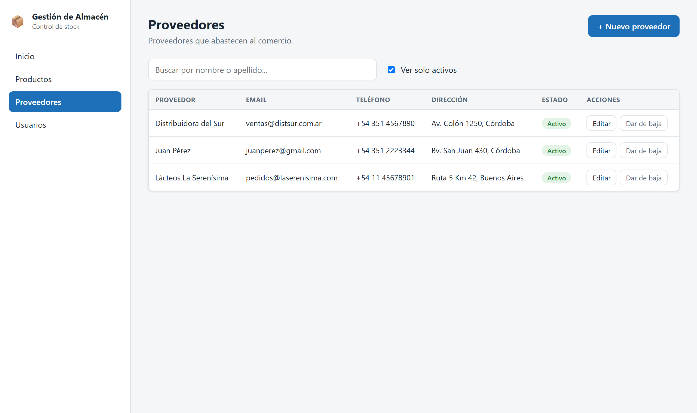

**Qué se puede hacer:**

- Listar los proveedores y buscarlos por nombre o apellido.
- Dar de alta uno nuevo. Solo el nombre es obligatorio.
- Modificar sus datos.
- Darlo de baja y reactivarlo.

**Reglas:**

- No puede haber dos proveedores con el mismo email.
- Un proveedor dado de baja no se puede asignar a un producto.
- Darlo de baja no afecta a sus productos: siguen en el catálogo.

## 5.3 Productos

Es el catálogo del comercio. Cada producto tiene su precio, su stock, el umbral para la alerta de
stock bajo y, si corresponde, su proveedor, su código de barras y su fecha de vencimiento.

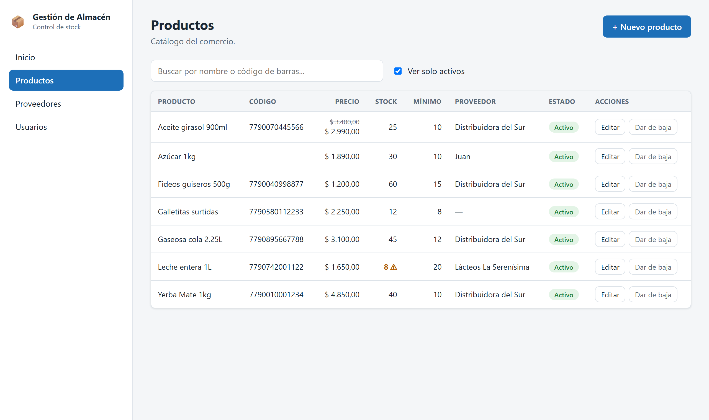

**Qué se puede hacer:**

- Listar el catálogo y buscar por nombre o por código de barras.
- Dar de alta un producto con su stock inicial.
- Modificar sus datos y su precio (CU-20).
- Marcarlo en oferta con un precio especial.
- Darlo de baja y reactivarlo.

**Reglas:**

- No puede haber dos productos con el mismo código de barras.
- El precio tiene que ser mayor a cero.
- Si está en oferta, el precio de oferta es obligatorio y tiene que ser menor al precio normal
  (CU-19 exc. 4a).
- El Empleado pone el precio al dar de alta un producto, pero después solo el Administrador puede
  cambiarlo. Las ofertas las define siempre el Administrador (CU-19, CU-20).
- El stock se carga solo en el alta, y queda registrado como el primer movimiento del producto. Al
  editarlo, el campo aparece bloqueado: el stock se ajusta desde la pantalla de stock, que deja
  registrado quién lo cambió y por qué (punto 5.6).
- Antes de dar de baja un producto que todavía tiene stock, el sistema lo avisa y pide
  confirmación (CU-02 exc. 3b).
- Si el stock está en el mínimo o por debajo, la tabla lo marca en naranja y con el símbolo ⚠.

El formulario marca en rojo cada campo con error, con el mensaje que manda el servidor:

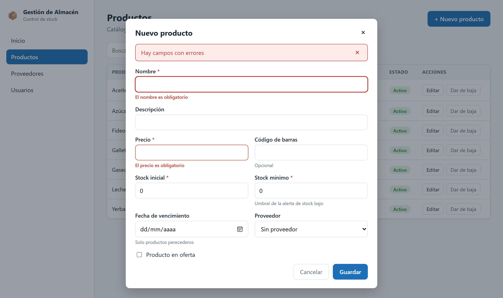

Al editar, los datos se cargan en el formulario y el stock queda bloqueado:

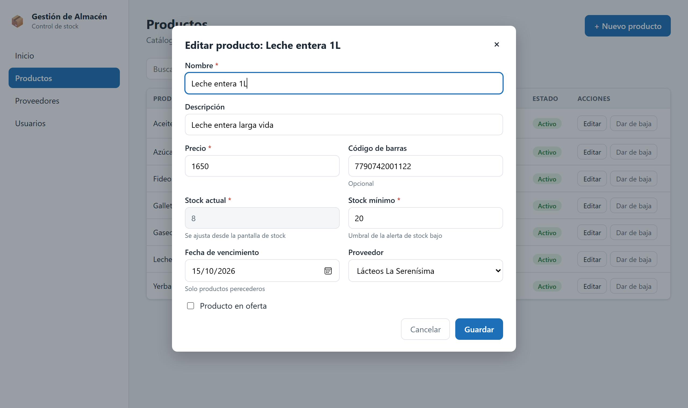

## 5.4 Usuarios

Permite administrar quiénes usan el sistema y con qué rol. Es exclusiva del Administrador.

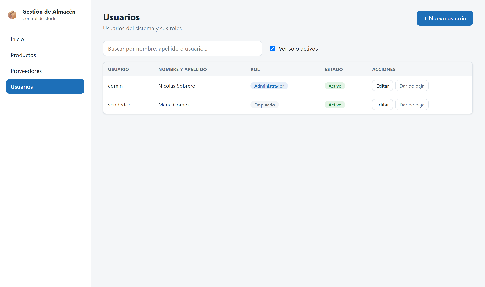

**Qué se puede hacer:**

- Listar los usuarios y buscarlos por nombre, apellido o nombre de usuario.
- Dar de alta uno nuevo, con su rol y su contraseña.
- Modificar sus datos. La contraseña solo cambia si se escribe una nueva.
- Darlo de baja y reactivarlo.

**Reglas:**

- No puede haber dos usuarios con el mismo nombre de usuario (CU-18 exc. 5a).
- La contraseña tiene que tener al menos 8 caracteres, con letras y números (RNF-02).
- La contraseña se guarda hasheada con BCrypt y nunca sale por la API.
- El sistema no puede quedarse sin un administrador activo: no se puede dar de baja al último ni
  quitarle el rol (CU-18 exc. 3a).

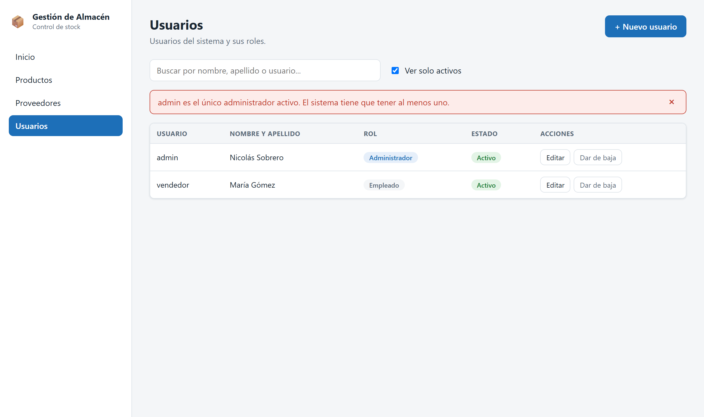

## 5.5 Inicio de sesión y permisos

Para usar el sistema hay que iniciar sesión con usuario y contraseña (CU-01). Lo que cada uno
puede hacer depende de su rol (RF-11).

**Cómo funciona:**

- El servidor compara la contraseña con el hash guardado. Si coincide, abre una sesión y el
  navegador recibe una cookie que ningún script puede leer.
- La sesión dura una jornada de trabajo: 8 horas. Al recargar la página no hay que volver a entrar.
- Cerrar sesión la invalida en el servidor, no solo en el navegador.
- Si la sesión vence mientras se usa el sistema, vuelve solo a la pantalla de inicio de sesión.

**Reglas:**

- Si falta el usuario o la contraseña, se marca el campo vacío (CU-01 exc. 3a).
- Si el usuario o la contraseña no coinciden, el mensaje es siempre el mismo: *"Usuario o
  contraseña incorrectos"*. No dice cuál de los dos falló, para no confirmarle a nadie qué usuarios
  existen (CU-01 exc. 4a).
- Un usuario dado de baja no puede entrar, y el mensaje lo explica.

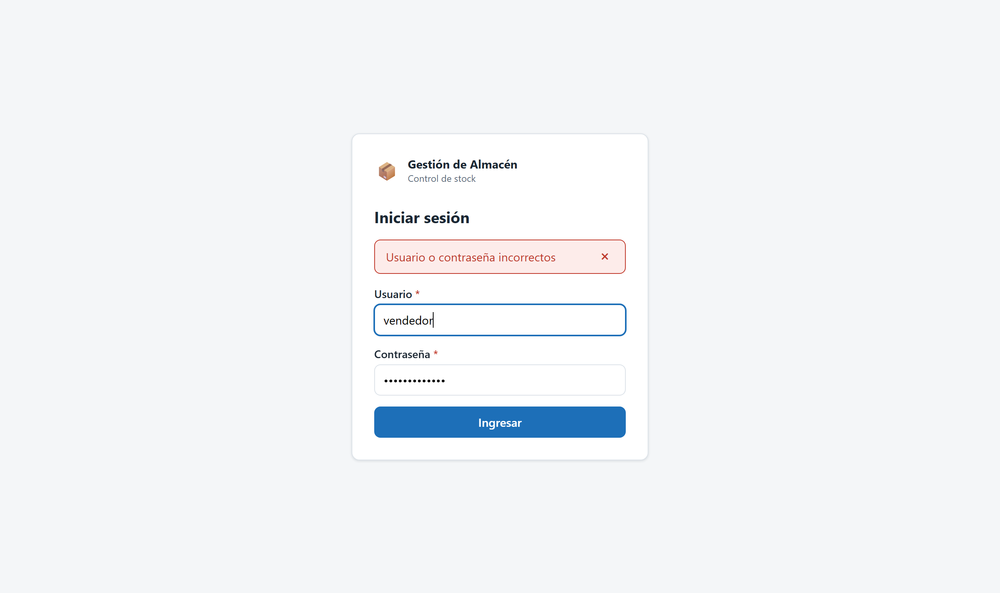

**Qué puede hacer cada rol:**

| Acción | Empleado | Administrador |
|---|---|---|
| Ver y buscar productos y proveedores | Sí | Sí |
| Dar de alta, editar, dar de baja y reactivar productos y proveedores | Sí | Sí |
| Cambiar el precio de un producto existente (CU-20) | No | Sí |
| Poner un producto en oferta (CU-19) | No | Sí |
| Ajustar el stock y ver sus movimientos (CU-04) | Sí | Sí |
| Ver las alertas del panel (CU-06) | Sí | Sí |
| Gestionar usuarios (CU-18) | No | Sí |

Los permisos se controlan en el servidor. La pantalla además esconde lo que el rol no puede usar:
el Empleado no ve la sección de usuarios en el menú y, al editar un producto, el precio y la oferta
le aparecen bloqueados. Pero eso es solo comodidad: aunque alguien llamara a la API directamente,
el servidor le respondería que no tiene permiso.

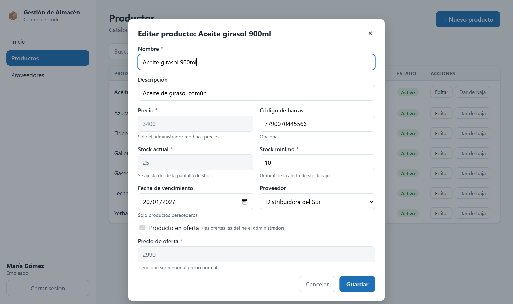

## 5.6 Stock

Muestra el stock actual y el mínimo de cada producto activo, y permite ajustarlo a mano (CU-04).
Sirve para todo lo que no pasa por una venta: la mercadería que llega del proveedor, la que se rompe
o se vence, y las correcciones después de contar lo que hay en la estantería (RF-02).

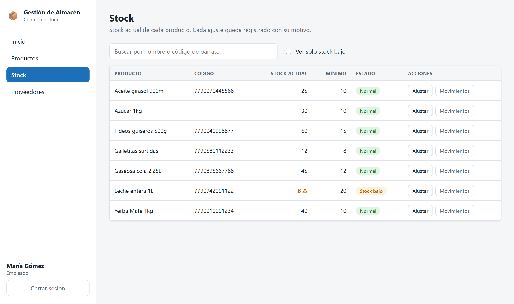

**Qué se puede hacer:**

- Ver el stock actual y el mínimo de cada producto, con su estado: normal o stock bajo.
- Buscar por nombre o por código de barras, y ver solo los que tienen stock bajo.
- Ajustar el stock de un producto, con el motivo.
- Ver los movimientos de un producto: cada cambio de stock con su fecha, quién lo hizo y por qué.

**Cómo se ajusta:** se escribe el stock que hay ahora, no la diferencia. Es lo que se hace en la
práctica: se cuenta la mercadería y se anota el número. Mientras se escribe, el formulario muestra
cuánto sube o baja, así un error de tipeo se ve antes de guardar.

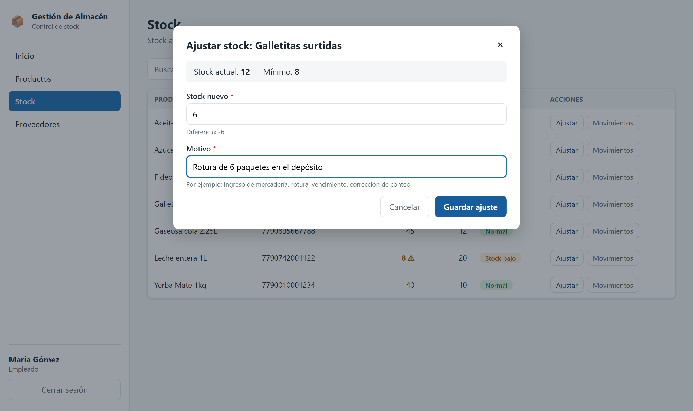

**Reglas:**

- El stock nuevo es obligatorio y no puede ser negativo (CU-04 exc. 5a).
- El motivo es obligatorio.
- Si el stock nuevo es igual al actual, el ajuste se rechaza: no cambia nada y solo agregaría un
  renglón vacío al historial.
- No se ajusta el stock de un producto dado de baja.
- Cada ajuste deja un movimiento con el stock anterior, el nuevo, el motivo, el usuario y la fecha.
  El stock y su movimiento se guardan juntos: si falla uno, no se guarda ninguno.
- Si el stock queda en el mínimo o por debajo, el sistema lo avisa y el producto pasa a las alertas
  del panel (CU-04 paso 7).

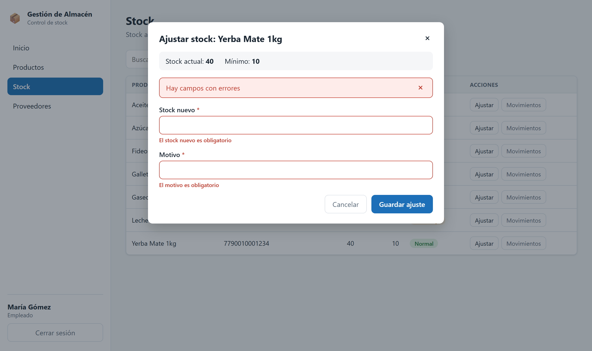

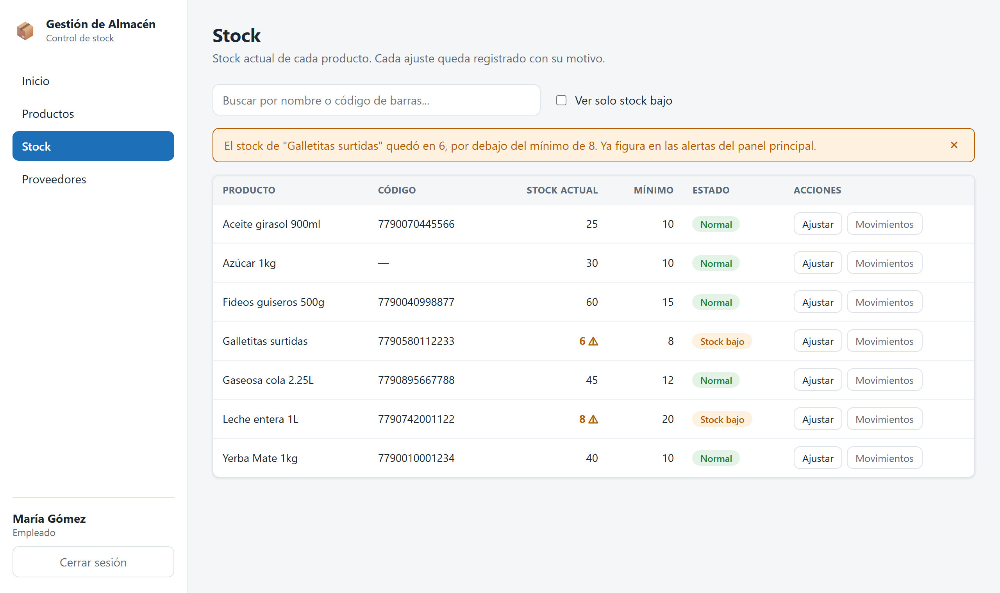

**Movimientos:** el botón "Movimientos" abre el historial del producto, del más nuevo al más viejo.
El primero siempre es la carga inicial, que se registra sola al dar de alta el producto. La
diferencia se muestra en verde cuando entra mercadería y en rojo cuando sale.

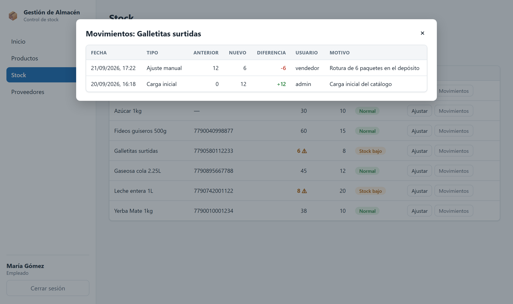

Como todo cambio de stock deja su movimiento, la suma de las diferencias siempre da el stock actual.
La consulta 10 de `base-de-datos/03-consultas-de-ejemplo.sql` lo comprueba.

## 5.7 Alertas

El panel principal avisa qué productos necesitan atención (RF-09 / CU-06). Las alertas se calculan
cada vez que se abre el panel y no se guardan: una alerta guardada quedaría desactualizada apenas
cambia el stock.

**Stock bajo.** Los productos con el stock en el mínimo o por debajo, empezando por el que tiene
menos. "Ajustar stock" abre la pantalla de stock con ese producto ya buscado (CU-06 paso 6).

**Próximos a vencer.** Los productos que vencen en los próximos 30 días, empezando por el más
próximo. Debajo de la fecha dice cuántos días faltan, o hace cuántos venció. "Ver producto" abre el
catálogo con ese producto ya buscado, para revisar sus datos.

**Reglas:**

- Los productos dados de baja no generan alertas.
- Un producto sin fecha de vencimiento no entra en la alerta de vencimiento.
- Un producto sin stock tampoco entra en la de vencimiento, porque no hay nada que se pueda vencer.
  Sí entra en la de stock bajo.
- Si no hay alertas de un tipo, la sección lo dice con un mensaje (CU-06 exc. 2a).
- Las tarjetas de arriba muestran cuántas alertas hay de cada tipo, y se marcan en naranja cuando
  hay alguna.

## 5.8 Decisiones de esta etapa

**No hay borrado definitivo.** Proveedores, productos y usuarios se dan de baja y se reactivan,
pero no se borran. Un producto dado de baja sigue apareciendo en las ventas pasadas, y un usuario
dado de baja sigue figurando como quien hizo las ventas y los ajustes que hizo. Borrarlos rompería
ese historial.

**Lo que entra es un DTO y lo que sale es la entidad.** El DTO tiene solo los campos que el usuario
puede mandar, así no se puede alterar el id, la fecha de alta ni el estado. La respuesta devuelve la
entidad directamente, y la contraseña queda excluida con `@JsonIgnore`.

**Los movimientos no se modifican ni se borran.** Son el registro de lo que pasó. Si un ajuste
estuvo mal, se corrige con otro ajuste y quedan los dos, igual que en un cuaderno de stock.

**El stock mínimo se configura en el producto.** CU-04 menciona cambiar el umbral desde la sección
de stock. Quedó en el formulario del producto, junto con el resto de sus datos, y la pantalla de
stock lo muestra al lado del stock actual. Así esa pantalla hace una sola cosa, y todo lo que pasa
por ella deja un movimiento.
