# 5. Módulos implementados

Cada módulo recorre todas las capas: una pantalla en React, una API en el backend, un servicio con
las reglas del negocio, un repositorio y la tabla de la base. Se construyen completos, uno por fase,
así cada fase termina con algo que se puede usar.

| Módulo | Requisitos | Fase | Estado |
|---|---|---|---|
| Proveedores | RF-08 / CU-05 | 2 | Implementado |
| Productos | RF-01 / CU-02, CU-20 | 2 | Implementado |
| Usuarios | RF-11 / CU-18 | 2 | Implementado |
| Inicio de sesión y roles | RF-11 / CU-01 | 3 | Implementado |
| Stock y alertas | RF-02, RF-09 / CU-04, CU-06 | 4 | Implementado |
| Ventas y ticket | RF-03, RF-06 / CU-07 a CU-09, CU-11 a CU-15 | 5 | Implementado |
| Historial y lector | RF-04, RF-07 / CU-03, CU-16 | 6 | Implementado |
| Ofertas | RF-10 / CU-19 | 7 | Implementado |

## 5.1 Estructura del código

**Backend** (`gestion-almacen/src/main/java/com/gestionalmacen/`):

| Paquete | Qué contiene |
|---|---|
| `entity` | Las clases que representan las tablas: `Supplier`, `Product`, `User`, `StockMovement`, `Sale`, `SaleDetail`, `Payment` |
| `dto` | Los datos que llegan en cada pedido, con sus validaciones. Y uno de salida: el producto con sus unidades vendidas, para las ofertas |
| `repository` | Las interfaces de acceso a la base |
| `service` | Las reglas del negocio. Cada servicio tiene su interfaz (`IProductService`) y su clase (`ProductService`) |
| `controller` | Los endpoints de la API |
| `exception` | Las excepciones propias y el manejador que las convierte en respuestas |
| `config` | La seguridad: quién puede entrar y a qué, y el algoritmo de contraseñas |

**Frontend** (`gestion-almacen-frontend/src/`):

| Carpeta | Qué contiene |
|---|---|
| `api` | Una función por cada llamada al backend |
| `components` | Piezas que se reusan: el menú, la ventana modal, el campo de formulario y los mensajes |
| `pages` | Una pantalla por sección, y el formulario de cada una |
| `utils` | Funciones chicas que usan varias pantallas: el formato de precios y fechas, y el reconocimiento de un código de barras |

Todas las pantallas siguen la misma estructura: una tabla con buscador, un botón para crear y, en
cada fila, los botones para editar y dar de baja. Quien entiende una, entiende las tres. La de stock
usa la misma tabla y el mismo buscador; en cada fila, los botones son ajustar y ver movimientos.

## 5.2 Proveedores

Permite registrar a quienes le venden mercadería al comercio, con sus datos de contacto.

**Qué se puede hacer:**

- Listar los proveedores y buscarlos por nombre o apellido.
- Dar de alta uno nuevo. Solo el nombre es obligatorio.
- Modificar sus datos.
- Darlo de baja y reactivarlo.

**Reglas:**

- No puede haber dos proveedores con el mismo email.
- Un proveedor dado de baja no se puede asignar a un producto.
- Darlo de baja no afecta a sus productos: siguen en el catálogo.

## 5.3 Productos

Es el catálogo del comercio. Cada producto tiene su precio, su stock, el umbral para la alerta de
stock bajo y, si corresponde, su proveedor, su código de barras y su fecha de vencimiento.

**Qué se puede hacer:**

- Listar el catálogo y buscar por nombre o por código de barras.
- Dar de alta un producto con su stock inicial.
- Modificar sus datos y su precio (CU-20).
- Marcarlo en oferta con un precio especial.
- Darlo de baja y reactivarlo.

**Reglas:**

- No puede haber dos productos con el mismo código de barras.
- El precio tiene que ser mayor a cero.
- Si está en oferta, el precio de oferta es obligatorio y tiene que ser menor al precio normal
  (CU-19 exc. 4a).
- El Empleado pone el precio al dar de alta un producto, pero después solo el Administrador puede
  cambiarlo. Las ofertas las define siempre el Administrador (CU-19, CU-20).
- El stock se carga solo en el alta, y queda registrado como el primer movimiento del producto. Al
  editarlo, el campo aparece bloqueado: el stock se ajusta desde la pantalla de stock, que deja
  registrado quién lo cambió y por qué (punto 5.6).
- Antes de dar de baja un producto que todavía tiene stock, el sistema lo avisa y pide
  confirmación (CU-02 exc. 3b).
- Si el stock está en el mínimo o por debajo, la tabla lo marca en naranja y con el símbolo ⚠.

El formulario marca en rojo cada campo con error, con el mensaje que manda el servidor:

Al editar, los datos se cargan en el formulario y el stock queda bloqueado:

## 5.4 Usuarios

Permite administrar quiénes usan el sistema y con qué rol. Es exclusiva del Administrador.

**Qué se puede hacer:**

- Listar los usuarios y buscarlos por nombre, apellido o nombre de usuario.
- Dar de alta uno nuevo, con su rol y su contraseña.
- Modificar sus datos. La contraseña solo cambia si se escribe una nueva.
- Darlo de baja y reactivarlo.

**Reglas:**

- No puede haber dos usuarios con el mismo nombre de usuario (CU-18 exc. 5a).
- La contraseña tiene que tener al menos 8 caracteres, con letras y números (RNF-02).
- La contraseña se guarda hasheada con BCrypt y nunca sale por la API.
- El sistema no puede quedarse sin un administrador activo: no se puede dar de baja al último ni
  quitarle el rol (CU-18 exc. 3a).

## 5.5 Inicio de sesión y permisos

Para usar el sistema hay que iniciar sesión con usuario y contraseña (CU-01). Lo que cada uno
puede hacer depende de su rol (RF-11).

**Cómo funciona:**

- El servidor compara la contraseña con el hash guardado. Si coincide, abre una sesión y el
  navegador recibe una cookie que ningún script puede leer.
- La sesión dura una jornada de trabajo: 8 horas. Al recargar la página no hay que volver a entrar.
- Cerrar sesión la invalida en el servidor, no solo en el navegador.
- Si la sesión vence mientras se usa el sistema, vuelve solo a la pantalla de inicio de sesión.

**Reglas:**

- Si falta el usuario o la contraseña, se marca el campo vacío (CU-01 exc. 3a).
- Si el usuario o la contraseña no coinciden, el mensaje es siempre el mismo: *"Usuario o
  contraseña incorrectos"*. No dice cuál de los dos falló, para no confirmarle a nadie qué usuarios
  existen (CU-01 exc. 4a).
- Un usuario dado de baja no puede entrar, y el mensaje lo explica.

**Qué puede hacer cada rol:**

| Acción | Empleado | Administrador |
|---|---|---|
| Ver y buscar productos y proveedores | Sí | Sí |
| Dar de alta, editar, dar de baja y reactivar productos y proveedores | Sí | Sí |
| Cambiar el precio de un producto existente (CU-20) | No | Sí |
| Poner un producto en oferta (CU-19) | No | Sí |
| Ver las sugerencias de ofertas (RF-10) | No | Sí |
| Ajustar el stock y ver sus movimientos (CU-04) | Sí | Sí |
| Ver las alertas del panel (CU-06) | Sí | Sí |
| Vender y ver el ticket (CU-07 a CU-15) | Sí | Sí |
| Usar el lector de código de barras (CU-03) | Sí | Sí |
| Consultar el historial de ventas (CU-16) | No | Sí |
| Gestionar usuarios (CU-18) | No | Sí |

Los permisos se controlan en el servidor. La pantalla además esconde lo que el rol no puede usar:
el Empleado no ve la sección de usuarios en el menú y, al editar un producto, el precio y la oferta
le aparecen bloqueados. Pero eso es solo comodidad: aunque alguien llamara a la API directamente,
el servidor le respondería que no tiene permiso.

## 5.6 Stock

Muestra el stock actual y el mínimo de cada producto activo, y permite ajustarlo a mano (CU-04).
Sirve para todo lo que no pasa por una venta: la mercadería que llega del proveedor, la que se rompe
o se vence, y las correcciones después de contar lo que hay en la estantería (RF-02).

**Qué se puede hacer:**

- Ver el stock actual y el mínimo de cada producto, con su estado: normal o stock bajo.
- Buscar por nombre o por código de barras, y ver solo los que tienen stock bajo.
- Ajustar el stock de un producto, con el motivo.
- Ver los movimientos de un producto: cada cambio de stock con su fecha, quién lo hizo y por qué.

**Cómo se ajusta:** se escribe el stock que hay ahora, no la diferencia. Es lo que se hace en la
práctica: se cuenta la mercadería y se anota el número. Mientras se escribe, el formulario muestra
cuánto sube o baja, así un error de tipeo se ve antes de guardar.

**Reglas:**

- El stock nuevo es obligatorio y no puede ser negativo (CU-04 exc. 5a).
- El motivo es obligatorio.
- Si el stock nuevo es igual al actual, el ajuste se rechaza: no cambia nada y solo agregaría un
  renglón vacío al historial.
- No se ajusta el stock de un producto dado de baja.
- Cada ajuste deja un movimiento con el stock anterior, el nuevo, el motivo, el usuario y la fecha.
  El stock y su movimiento se guardan juntos: si falla uno, no se guarda ninguno.
- Si el stock queda en el mínimo o por debajo, el sistema lo avisa y el producto pasa a las alertas
  del panel (CU-04 paso 7).

**Movimientos:** el botón "Movimientos" abre el historial del producto, del más nuevo al más viejo.
El primero siempre es la carga inicial, que se registra sola al dar de alta el producto. La
diferencia se muestra en verde cuando entra mercadería y en rojo cuando sale.

Como todo cambio de stock deja su movimiento, la suma de las diferencias siempre da el stock actual.
La consulta 10 de `base-de-datos/03-consultas-de-ejemplo.sql` lo comprueba.

## 5.7 Alertas

El panel principal avisa qué productos necesitan atención (RF-09 / CU-06). Las alertas se calculan
cada vez que se abre el panel y no se guardan: una alerta guardada quedaría desactualizada apenas
cambia el stock.

**Stock bajo.** Los productos con el stock en el mínimo o por debajo, empezando por el que tiene
menos. "Ajustar stock" abre la pantalla de stock con ese producto ya buscado (CU-06 paso 6).

**Próximos a vencer.** Los productos que vencen en los próximos 30 días, empezando por el más
próximo. Debajo de la fecha dice cuántos días faltan, o hace cuántos venció. "Ver producto" abre el
catálogo con ese producto ya buscado, para revisar sus datos.

**Reglas:**

- Los productos dados de baja no generan alertas.
- Un producto sin fecha de vencimiento no entra en la alerta de vencimiento.
- Un producto sin stock tampoco entra en la de vencimiento, porque no hay nada que se pueda vencer.
  Sí entra en la de stock bajo.
- Si no hay alertas de un tipo, la sección lo dice con un mensaje (CU-06 exc. 2a).
- Las tarjetas de arriba muestran cuántas alertas hay de cada tipo, y se marcan en naranja cuando
  hay alguna.

## 5.8 Venta

Es la pantalla que más se usa (RF-03 / CU-07 a CU-11). A la izquierda se buscan los productos; a
la derecha se arma el carrito, se elige la forma de pago y se confirma.

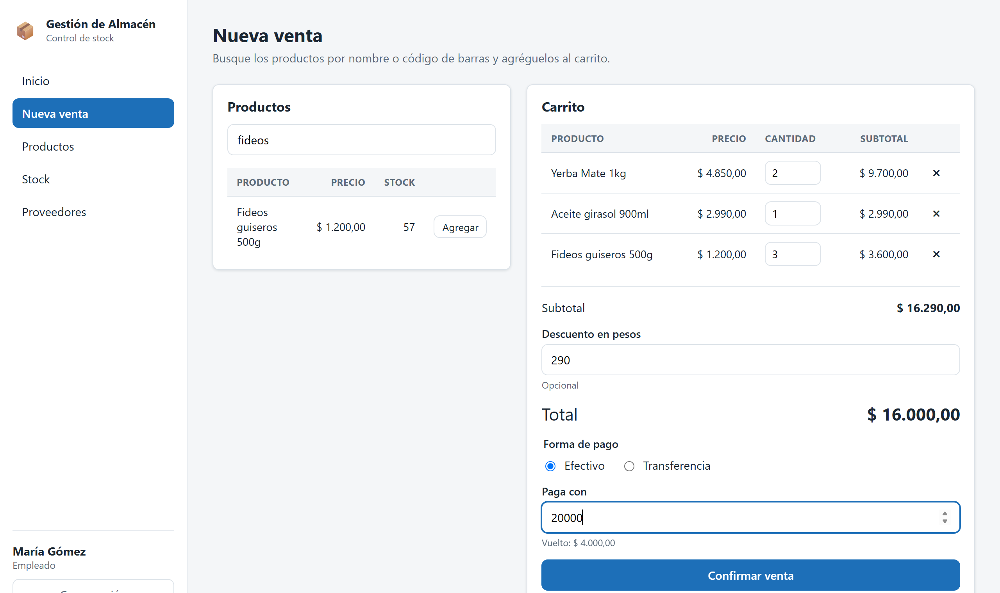

**Cómo se arma el carrito:**

- Se busca por nombre o código de barras mientras se escribe. Si no hay coincidencias, se avisa
  (CU-07 exc. 3a).
- "Agregar" suma una unidad. Si el producto ya está en el carrito, suma una más a su renglón.
- La cantidad se puede escribir en el renglón, y el renglón se quita con la cruz.
- Un producto en oferta se cobra al precio de oferta, y en la búsqueda aparece el precio normal
  tachado.
- Un producto sin stock aparece en la búsqueda, pero no se puede agregar.

**Reglas del carrito:**

- La cantidad tiene que ser al menos 1 (CU-08 exc. 3a).
- No se puede pedir más de lo que hay. El renglón lo marca con la cantidad disponible, y el botón
  para agregar avisa cuando ya no quedan unidades (CU-07 exc. 5a, CU-08 exc. 4a).
- El descuento es en pesos y tiene que ser menor al subtotal: el total nunca queda en cero.
- Si falta algo o hay un error, "Confirmar venta" queda deshabilitado. Sin productos tampoco se
  puede confirmar (CU-11 exc. 1a).

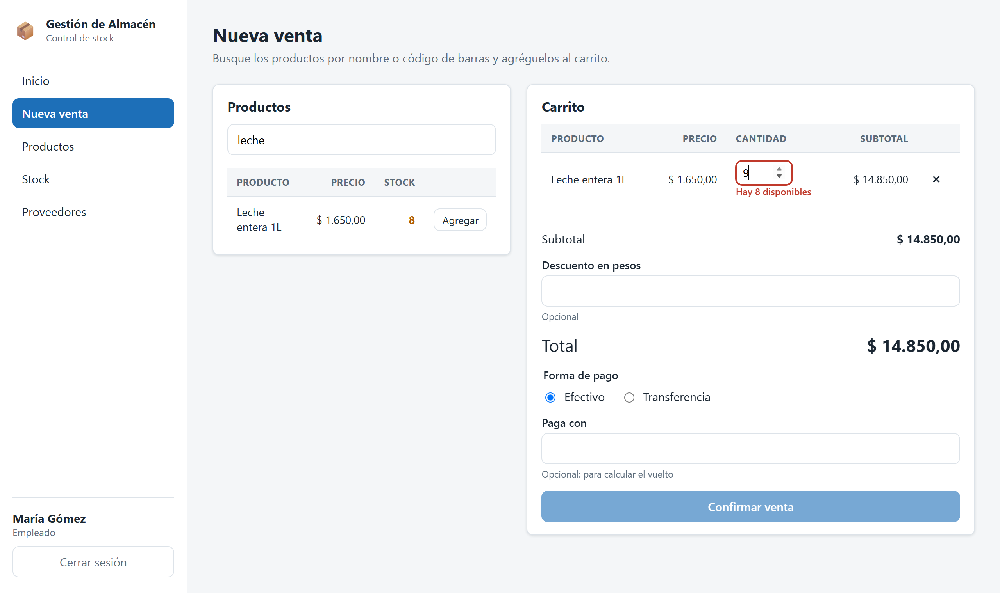

**Formas de pago (CU-09):**

- **Efectivo.** El campo "Paga con" es opcional: si se completa, el sistema calcula el vuelto. Si
  lo que paga no alcanza, lo marca y no deja confirmar.
- **Transferencia.** Se confirma cuando la transferencia figura acreditada en la cuenta del
  comercio.

MercadoPago (CU-10) no está incluido en esta fase. La base de datos ya tiene lo necesario para
sumarlo: el estado de pago pendiente y la referencia del pago externo.

**Qué pasa al confirmar (CU-11 a CU-13):** el servidor vuelve a controlar todo, porque el stock
pudo cambiar mientras se armaba el carrito. Si está bien, en una sola transacción:

1. Registra la venta con la fecha, el usuario y cada renglón con el precio del momento.
2. Registra el pago como aprobado.
3. Descuenta el stock de cada producto y deja un movimiento de tipo venta, con el número de venta
   como motivo (CU-12).

Si algo falla, no se guarda nada. Si algún producto queda con stock bajo, aparece en las alertas
del panel (CU-12 paso 4).

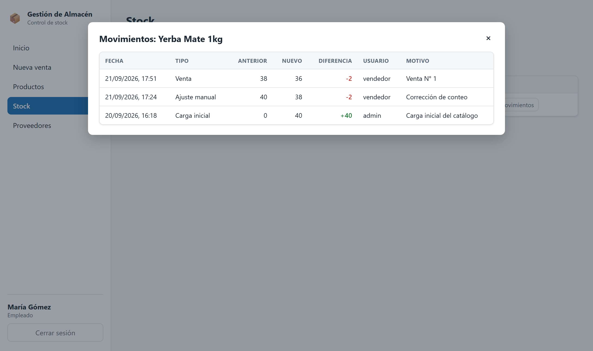

## 5.9 Ticket

Después de confirmar, el sistema muestra el ticket de la venta (RF-06 / CU-14).

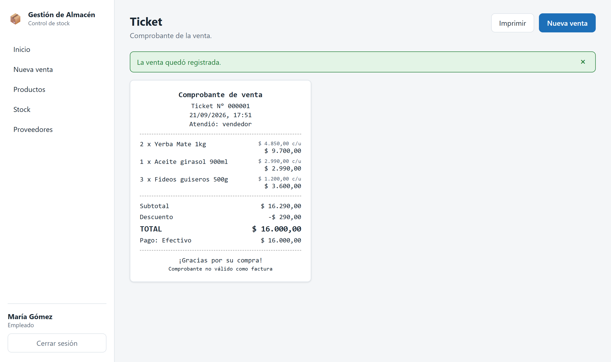

**Qué muestra:** el número de ticket, que es el número de la venta; la fecha y la hora; quién
atendió; cada producto con su cantidad, su precio unitario y su subtotal; el subtotal, el
descuento, el total y la forma de pago.

El ticket no se guarda como archivo. Se arma cada vez con los datos guardados de la venta, que no
cambian aunque después cambien los productos. Por eso se puede volver a abrir y a imprimir las
veces que haga falta.

**Impresión (CU-15):** el botón "Imprimir" abre el diálogo de impresión del navegador. Ahí se
elige la impresora de tickets, que Windows trata como cualquier otra impresora. En el papel sale
solo el comprobante, con el ancho de un ticket de 80 mm: sin el menú y sin los botones. Si la
impresora no está disponible, el diálogo lo informa y el ticket sigue en pantalla (CU-15 exc. 2a).

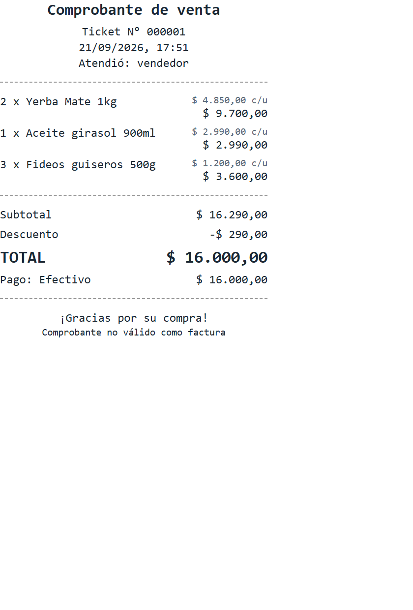

El pie aclara que el comprobante no es válido como factura: el comercio no emite comprobantes
fiscales desde este sistema.

## 5.10 Historial de ventas

Permite al Administrador consultar todas las ventas hechas y cuánto se recaudó (RF-07 / CU-16).
El Empleado no lo ve en el menú, y si pide el historial a la API, el servidor responde que no
tiene permiso.

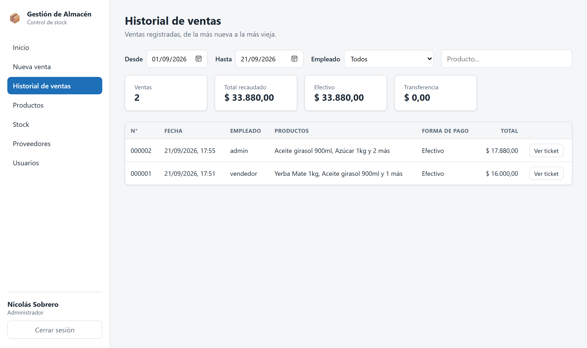

**Qué se puede hacer:**

- Ver las ventas de un período, de la más nueva a la más vieja. Al entrar se muestra el mes en
  curso, del día 1 a hoy.
- Filtrar por empleado y por producto. El producto se busca por nombre dentro de los renglones de
  cada venta.
- Ver cuántas ventas hay, el total recaudado y cuánto entró por cada forma de pago (CU-16 paso 6).
- Abrir el ticket de cualquier venta y volver al historial con los mismos filtros (CU-16 paso 5).
- Si no hay ventas con esos filtros, se informa con un mensaje (CU-16 exc. 3a).

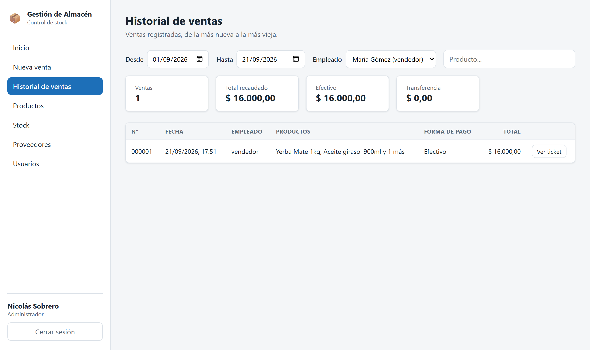

**Reglas:**

- La fecha desde no puede ser posterior a la fecha hasta.
- La fecha hasta incluye todo ese día.
- El filtro de empleado incluye a los usuarios dados de baja, que pueden tener ventas viejas.

Los filtros quedan guardados en la dirección de la página, por ejemplo
`/sales?from=2026-09-01&to=2026-09-21&username=vendedor`. Por eso, al volver de un ticket, el
historial sigue filtrado igual.

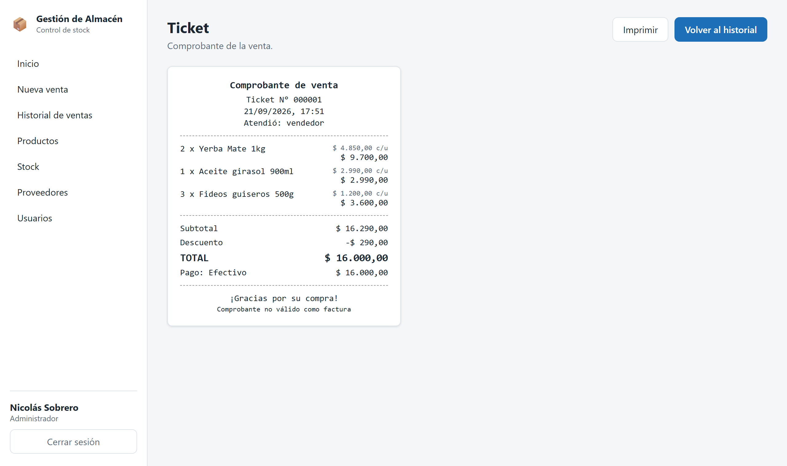

El total por forma de pago es la base para el cierre de caja: se compara con el efectivo que hay en
la caja y con las transferencias que entraron a la cuenta del comercio.

## 5.11 Lector de código de barras

Permite cargar productos sin escribir (RF-04 / CU-03). El lector se conecta por USB y funciona
como un teclado: escribe los números del código y aprieta Enter. No hace falta instalar nada.

El sistema toma como lectura del lector un Enter en el buscador cuando lo escrito son solo
números, como los códigos EAN de los productos. Si se escribe un nombre y se aprieta Enter, no pasa
nada: la búsqueda por nombre sigue funcionando igual que siempre.

**En una venta (CU-03 paso 4):** el producto leído se agrega al carrito, o suma una unidad si ya
estaba. El buscador queda vacío y con el cursor adentro, listo para el próximo producto. También
vuelve al buscador después de tocar "Agregar", así el lector nunca escribe en otro lado.

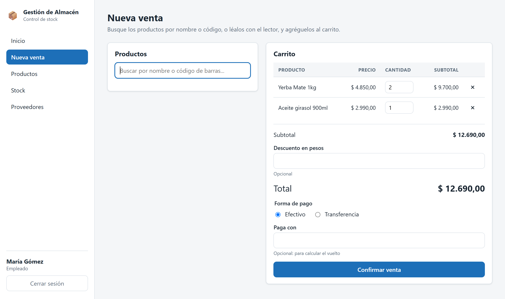

**En el catálogo (CU-03 paso 5):** el producto leído se abre en su ficha, para ver o modificar sus
datos.

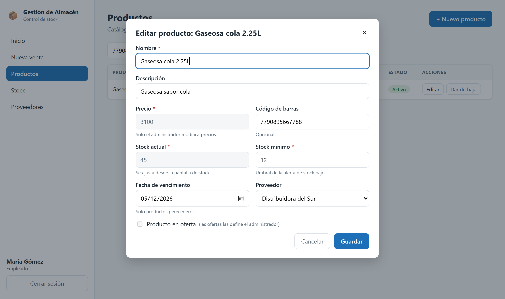

**Si el código no existe (CU-03 paso 6):** el sistema lo avisa y ofrece darlo de alta. El
formulario se abre con el código ya cargado. En una venta, al guardarlo, el producto nuevo entra
directo al carrito. Si el usuario cierra el aviso o el formulario, todo queda como estaba
(CU-03 exc. 3a).

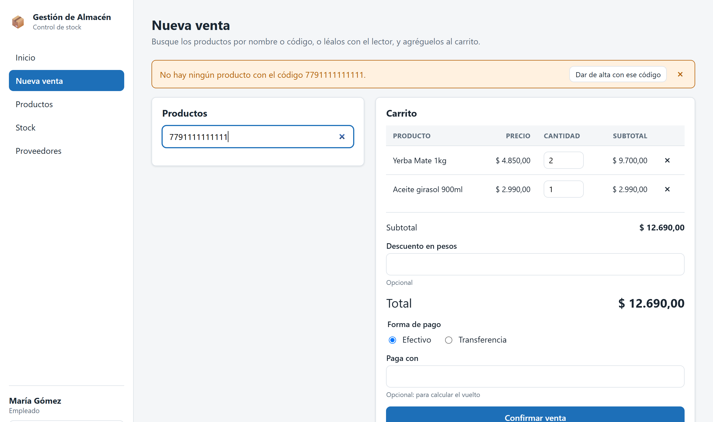

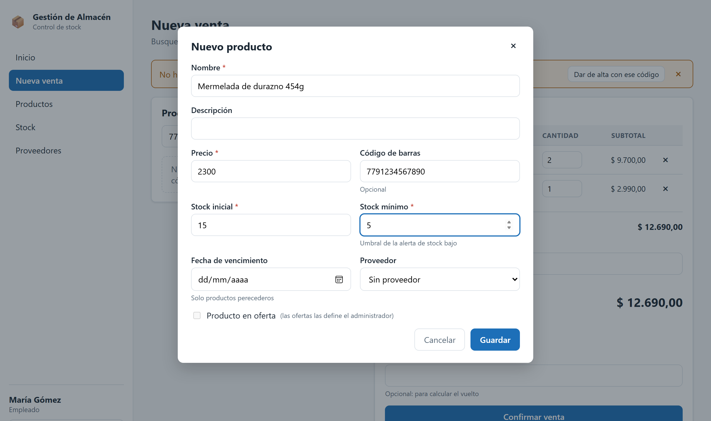

## 5.12 Ofertas

Ayuda al Administrador a decidir qué productos promocionar (RF-10 / CU-19). El sistema sugiere
candidatos, pero nunca pone una oferta solo: la decisión es siempre del Administrador. El Empleado
no ve esta sección.

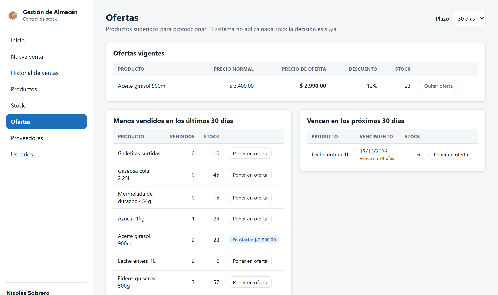

**Qué muestra:**

- **Ofertas vigentes:** los productos que están en oferta, con el precio normal, el de oferta, el
  descuento en porcentaje y el stock. Cada una se puede quitar en cualquier momento (CU-19 paso 6).
- **Menos vendidos:** los 10 productos con stock que menos se vendieron en el plazo elegido. Un
  producto sin ventas aparece con cero. Es la sugerencia por baja rotación.
- **Próximos a vencer:** los productos con stock que vencen dentro del plazo. Es la misma consulta
  que la alerta del panel principal.

El plazo se elige arriba a la derecha: 15, 30 o 60 días, porque RF-10 pide que sea configurable.
Vale para las dos sugerencias.

En las sugerencias, un producto que ya está en oferta muestra su precio de oferta en lugar del
botón.

**Cómo se pone una oferta (CU-19 paso 4):** "Poner en oferta" abre una ventana con el precio normal
y el stock. Mientras se escribe el precio de oferta, el sistema muestra cuánto descuento
representa.

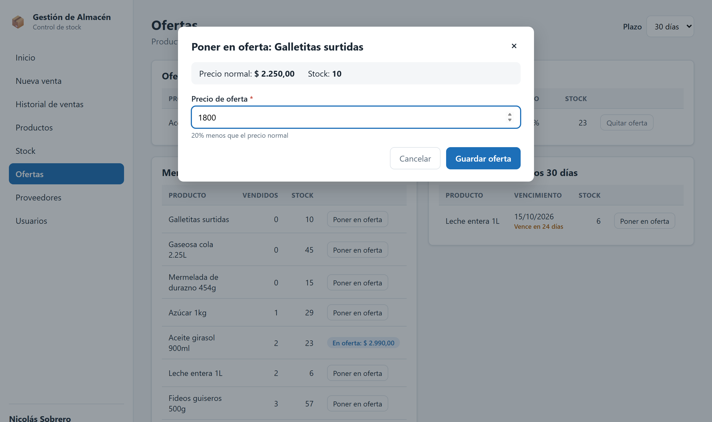

Al guardar, el producto pasa a las ofertas vigentes y en la venta se cobra al precio de oferta
(CU-19 paso 5).

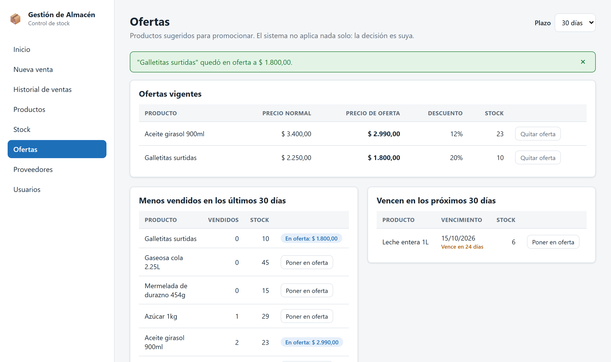

**Reglas:**

- El precio de oferta es obligatorio y tiene que ser menor al precio normal (CU-19 exc. 4a). La
  pantalla lo marca mientras se escribe y no deja guardar.
- No se pone en oferta un producto dado de baja.
- Al quitar la oferta, el producto vuelve a su precio normal.
- Los productos dados de baja o sin stock no se sugieren: no hay nada que promocionar.

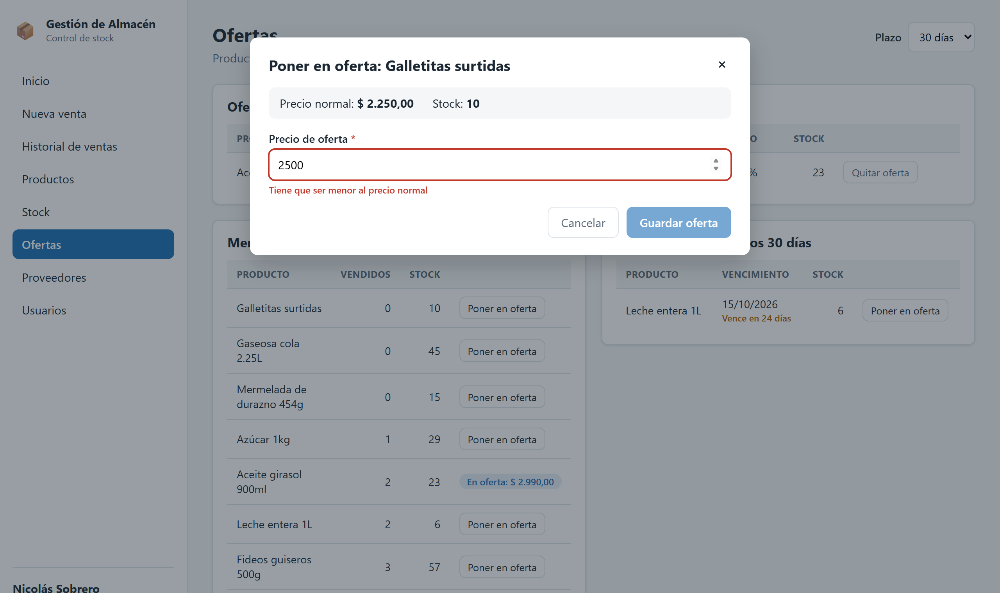

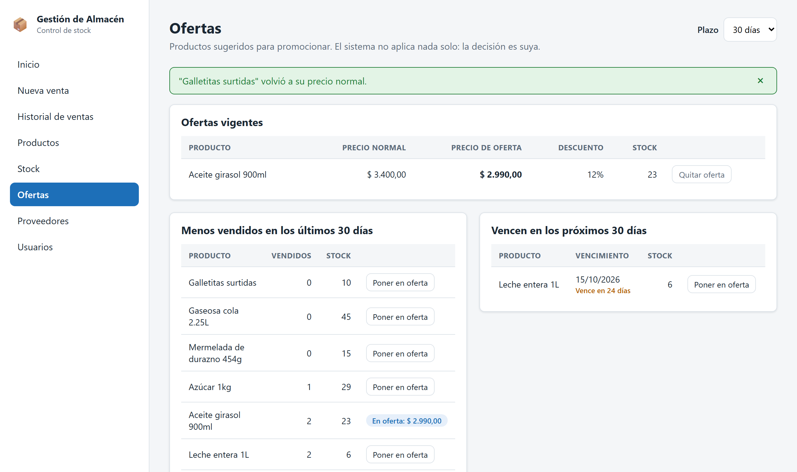

## 5.13 Decisiones de esta etapa

**No hay borrado definitivo.** Proveedores, productos y usuarios se dan de baja y se reactivan,
pero no se borran. Un producto dado de baja sigue apareciendo en las ventas pasadas, y un usuario
dado de baja sigue figurando como quien hizo las ventas y los ajustes que hizo. Borrarlos rompería
ese historial.

**Lo que entra es un DTO y lo que sale es la entidad.** El DTO tiene solo los campos que el usuario
puede mandar, así no se puede alterar el id, la fecha de alta ni el estado. La respuesta devuelve la
entidad directamente, y la contraseña queda excluida con `@JsonIgnore`. Hay una sola excepción: la
sugerencia por baja rotación devuelve el producto junto con sus unidades vendidas, que no son un
dato del producto sino un cálculo, así que sale en un DTO (`ProductSalesDTO`).

**Los movimientos no se modifican ni se borran.** Son el registro de lo que pasó. Si un ajuste
estuvo mal, se corrige con otro ajuste y quedan los dos, igual que en un cuaderno de stock.

**El stock mínimo se configura en el producto.** CU-04 menciona cambiar el umbral desde la sección
de stock. Quedó en el formulario del producto, junto con el resto de sus datos, y la pantalla de
stock lo muestra al lado del stock actual. Así esa pantalla hace una sola cosa, y todo lo que pasa
por ella deja un movimiento.

**El carrito vive en la pantalla, no en el servidor.** Mientras se arma no se guarda nada: si el
cliente se arrepiente, no queda una venta a medias en la base. Al servidor le llega la venta
completa cuando se confirma, y ahí se valida todo de nuevo.

**El precio lo pone el servidor.** Del carrito solo viajan el producto y la cantidad. Así nadie
puede cambiar un precio desde el navegador, y la regla de que solo el Administrador maneja los
precios se sigue cumpliendo también en la venta.

**El historial se filtra por el nombre de los productos vendidos.** Los renglones guardan una copia
del nombre, así que una venta vieja se encuentra por el nombre que tenía el producto cuando se
vendió, aunque después haya cambiado o se haya dado de baja.

**Un Enter con números es una lectura del lector.** El lector no se distingue de un teclado. En
lugar de configurar algo especial, se usa lo que hace siempre: números y Enter. Así funciona con
cualquier lector USB.

**La oferta con precio mayor al normal no se puede confirmar.** CU-19 exc. 4a dice que el sistema
advierte y pide confirmar o corregir. Se dejó solo la opción de corregir: una "oferta" más cara que
el precio normal no tiene sentido, y la base de datos la rechaza con una restricción desde la
fase 0.
