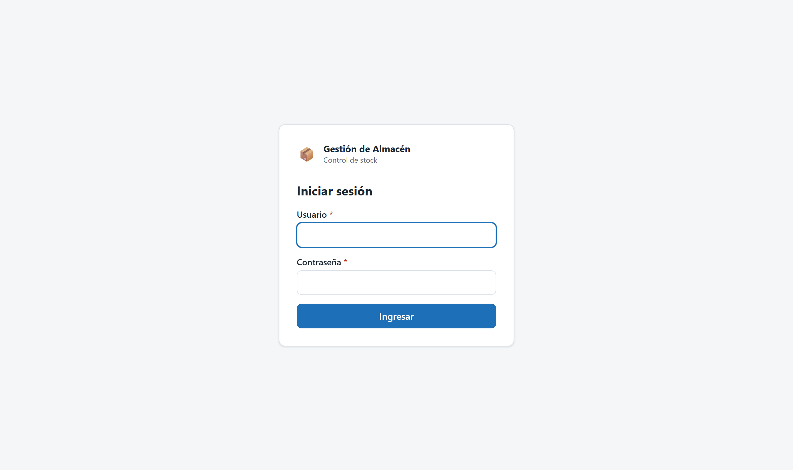
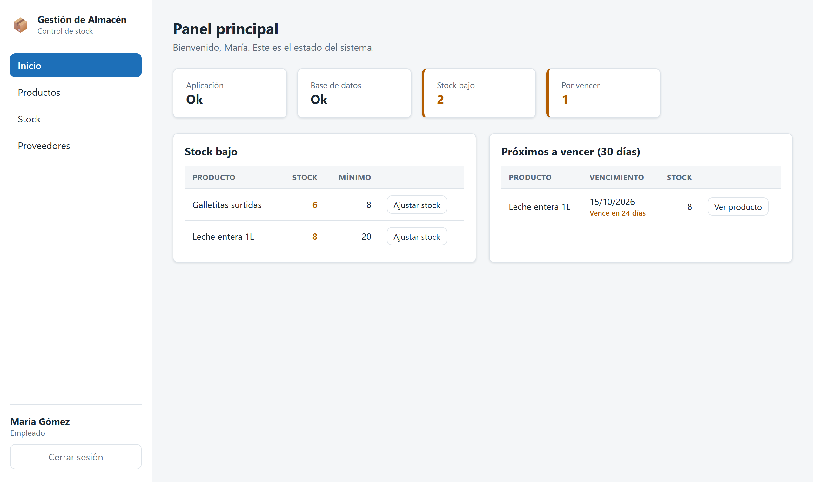

# 7. Manual de instalación y configuración

Pasos para dejar el sistema funcionando en una computadora con Windows 10 u 11.

## 7.1 Programas necesarios

| Programa | Versión usada | Para qué |
|---|---|---|
| JDK de Java | 25.0.1 | Compilar y ejecutar el backend |
| MySQL Server | 8.0.42 | Base de datos |
| MySQL Workbench | 8.0 | Ver la base y probar consultas. Opcional |
| Node.js | 24.14.1 | Ejecutar el frontend |
| Git | Cualquiera reciente | Descargar el proyecto |

Maven no se instala: el proyecto trae el ejecutable `mvnw`, que lo descarga solo la primera vez.

## 7.2 Descargar el proyecto

```bash
git clone https://github.com/nicosobrero14-hue/sistema-gestion-almacen.git
```

```bash
cd sistema-gestion-almacen
```

## 7.3 Crear la base de datos

Con MySQL en ejecución, desde la carpeta del proyecto:

```bash
mysql -u root -p < base-de-datos/01-esquema.sql
```

```bash
mysql -u root -p gestion_almacen < base-de-datos/02-datos-de-prueba.sql
```

El primero crea la base `gestion_almacen` y sus siete tablas. El segundo carga los datos de prueba.

Para verificar que quedó bien:

```bash
mysql -u root -p -e "SHOW TABLES;" gestion_almacen
```

Tienen que aparecer las siete tablas: `detalle_venta`, `movimientos_stock`, `pagos`, `productos`,
`proveedores`, `usuarios` y `ventas`.

## 7.4 Configurar la conexión

Las credenciales de MySQL no están en el repositorio. Hay que crear el archivo local:

1. Ir a `gestion-almacen/src/main/resources/`.
2. Copiar `application-local.properties.ejemplo` y renombrar la copia como
   `application-local.properties`.
3. Abrirla y completar el usuario y la clave del MySQL propio:

```properties
spring.datasource.username=root
spring.datasource.password=la_clave_de_tu_mysql
```

Git ignora ese archivo, así que la clave nunca se sube al repositorio.

## 7.5 Arrancar el backend

```bash
cd gestion-almacen
```

```bash
mvnw spring-boot:run
```

La primera vez tarda algunos minutos porque descarga las dependencias. Cuando termina, en la consola
aparece `Started GestionAlmacenApplication`. El backend queda escuchando en el puerto 8080.

Para comprobarlo, en el navegador: `http://localhost:8080/api/status`. Tiene que responder:

```json
{ "application": "ok", "database": "ok" }
```

## 7.6 Arrancar el frontend

En otra consola:

```bash
cd gestion-almacen-frontend
```

```bash
npm install
```

```bash
npm run dev
```

El sistema queda disponible en `http://localhost:5173`.

`npm install` se ejecuta una sola vez, la primera. Después alcanza con `npm run dev`.

## 7.7 Verificar la instalación

Abrir `http://localhost:5173`. Aparece la pantalla de inicio de sesión.



Los datos de prueba traen dos usuarios:

| Usuario | Contraseña | Rol |
|---|---|---|
| `admin` | `Admin1234` | Administrador |
| `vendedor` | `Empleado1234` | Empleado |

**Son contraseñas de prueba.** Antes de usar el sistema en el comercio hay que cambiar la del
administrador desde la pantalla de usuarios, y dar de baja o modificar el usuario `vendedor`.

Después de entrar, en el panel principal tienen que aparecer las dos tarjetas de estado en **Ok**:
una para la aplicación y otra para la base de datos. Con los datos de prueba, además, la leche
aparece en la alerta de stock bajo.



Si la tarjeta de base de datos dice "sin conexión", revisar el punto 7.4.

## 7.8 Problemas frecuentes

| Problema | Causa y solución |
|---|---|
| `Port 8080 was already in use` | Hay otro programa en ese puerto, o quedó una ejecución anterior abierta. Cerrarla o cambiar `server.port` en `application.properties` |
| `Access denied for user 'root'@'localhost'` | El usuario o la clave de `application-local.properties` no coinciden con los de MySQL |
| `Unknown database 'gestion_almacen'` | Falta ejecutar el script del punto 7.3 |
| `Schema-validation: missing table` | La base existe pero le faltan tablas. Volver a ejecutar el esquema |
| La pantalla carga pero dice que no se pudo conectar | El backend no está en ejecución. Arrancarlo con `mvnw spring-boot:run` |
| `mvnw` no se reconoce como comando | Hay que ejecutarlo desde la carpeta `gestion-almacen` |
| "Usuario o contraseña incorrectos" con los usuarios de prueba | Falta cargar los datos de prueba del punto 7.3 |
| La hora de los movimientos no coincide con la real | El backend guarda la hora de la computadora en la que corre. Si MySQL está en otra computadora, las dos tienen que tener la misma zona horaria |

## 7.9 Ejecutar las pruebas automáticas

```bash
cd gestion-almacen
```

```bash
mvnw test
```

Las pruebas usan una base en memoria, así que no necesitan MySQL ni modifican los datos reales.
