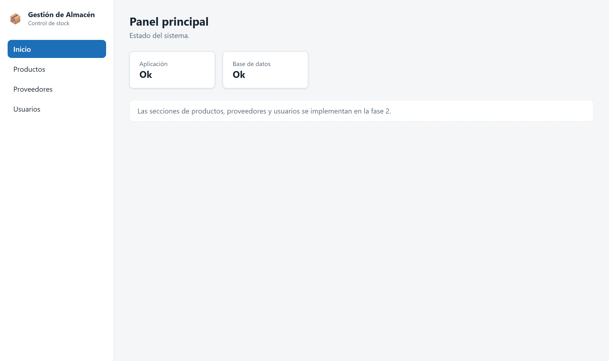

# 10. Bitácora del desarrollo

Registro de lo que se hizo en cada fase, las decisiones que se tomaron y cómo se verificó el
resultado.

---

## Fase 0 — Repositorio, documentación y modelo de datos

**20 de septiembre de 2026**

### Qué se hizo

1. Se creó el repositorio con la estructura de carpetas: `base-de-datos/`, `documentacion/` y las
   dos carpetas del código, que se completan en la fase siguiente.
2. Se escribió el esquema completo de la base: siete tablas con sus claves, restricciones e
   índices.
3. Se cargaron los datos de prueba: dos usuarios, tres proveedores y ocho productos, con casos
   variados a propósito (con y sin código de barras, con y sin vencimiento, uno bajo el mínimo,
   uno en oferta y uno dado de baja).
4. Se escribieron diez consultas de ejemplo que cubren las necesidades de los requisitos.
5. Se documentó el análisis, la arquitectura, las tecnologías y el modelo de datos, con sus dos
   diagramas.

### Decisiones

**El modelo de datos se diseña completo desde el principio, no fase por fase.** Las tablas de
ventas y pagos se crean ahora aunque el módulo de ventas llegue en la fase 5. Diseñar el modelo
entero de una vez evita tener que modificar tablas más adelante, que es cuando aparecen los
problemas: datos que migrar, código que ajustar y consultas que revisar.

**El número de ticket es el identificador de la venta.** No se agrega una secuencia aparte. El
comercio no emite comprobantes fiscales, así que no hay requisito de numeración propia.

**Las alertas no se guardan en la base.** Se calculan con una consulta cada vez que se abre el
panel. Una alerta guardada queda desactualizada apenas cambia el stock.

El detalle de estas decisiones y del resto está en `04-modelo-datos.md`.

### Cómo se verificó

El esquema se ejecutó sobre una base temporal, separada de la de desarrollo:

- Las siete tablas se crearon sin errores y los datos de prueba cargaron completos: 3 proveedores,
  8 productos, 2 usuarios y 8 movimientos de carga inicial.
- Se intentó insertar diez datos inválidos (stock negativo, precio en cero, oferta más cara que el
  precio, rol inexistente, usuario repetido, correo repetido, código de barras repetido, descuento
  mayor al subtotal, cantidad cero y tipo de movimiento inventado). La base los rechazó a todos.
- Se cargó una venta completa con dos renglones, su pago y sus movimientos de stock. El stock quedó
  consistente con la suma de los movimientos.
- Se borró un proveedor: sus cuatro productos sobrevivieron, sin proveedor asignado.
- Se borró un producto vendido: el renglón de la venta conservó el nombre y el precio.
- Se borró una venta: se fueron sus renglones y su pago, y el movimiento de stock quedó registrado.

La base temporal se eliminó al terminar.

### Estado al cerrar la fase

La base de datos está diseñada, documentada y probada. El repositorio tiene la documentación de las
cuatro primeras actividades de la guía. Falta el código, que empieza en la fase 1.

---

## Fase 1 — Esqueleto

**20 de septiembre de 2026**

### Qué se hizo

1. Se creó el proyecto del backend con Spring Boot, conectado a MySQL.
2. Se agregó un endpoint de estado, `GET /api/status`, que informa si la aplicación responde y si la
   base contesta.
3. Se creó el proyecto del frontend con React y Vite, con el menú lateral y las cuatro secciones.
4. La pantalla de inicio consulta el estado y lo muestra.
5. Se escribió el manual de instalación.

### Decisiones

**El código se escribe en inglés y la base de datos queda en español.** Las clases, las variables y
las rutas de la API usan la convención del lenguaje. Las tablas y columnas mantienen los nombres del
análisis, así el diccionario de datos y el modelo se leen igual en los dos lados. La unión la hacen
las anotaciones `@Table` y `@Column`.

**El endpoint de estado existe para poder probar la cadena completa.** Sin él, el frontend de esta
fase no tendría nada que pedirle al backend y no habría forma de demostrar que las tres partes se
comunican.

**La seguridad todavía no se configura.** Se agrega en la fase 3, junto con el inicio de sesión.
Sumarla antes obligaría a dejar todo abierto con una configuración provisional que después habría
que reescribir.

**El backend arranca con `validate`.** Hibernate no modifica las tablas: solo verifica que el mapeo
coincida con lo que hay en la base. Si una entidad no coincide, la aplicación no levanta y el error
aparece enseguida, no cuando un dato se guarda mal.

### Cómo se verificó

- `mvnw test`: 2 pruebas en verde, el arranque del contexto y la respuesta del endpoint de estado.
- El backend levantó contra MySQL y quedó registrado `Started GestionAlmacenApplication`.
- La pantalla de inicio muestra las dos tarjetas en **Ok**, lo que prueba el camino completo:
  React, el proxy de Vite, Spring Boot y MySQL.
- El frontend compila para producción con `npm run build`.

### Estado al cerrar la fase

El sistema arranca de punta a punta. Las secciones de productos, proveedores y usuarios están en el
menú pero todavía sin contenido: se implementan en la fase 2.

---

## Fase 2 — Proveedores, productos y usuarios

**21 de septiembre de 2026**

### Qué se hizo

1. Las tres entidades con su mapeo a las tablas: `Supplier`, `Product` y `User`.
2. Para cada una: DTO con validaciones, repositorio con búsqueda, servicio con sus reglas y
   controlador con seis endpoints (listar, traer, crear, modificar, dar de baja y reactivar).
3. Un manejador de errores único, que devuelve siempre el mismo formato: mensaje general y error de
   cada campo.
4. El hash de contraseñas con BCrypt.
5. Las tres pantallas, con tabla, buscador, filtro de activos y formulario en una ventana.
6. 25 pruebas automáticas nuevas.
7. Los documentos de módulos, API y pruebas.

### Decisiones

**No hay borrado definitivo, solo baja y reactivación.** Un producto dado de baja sigue figurando
en las ventas que ya se hicieron, y un usuario dado de baja sigue siendo quien las registró. El
borrado rompería ese historial. Además simplifica la interfaz: dos botones por fila en lugar de
tres, y ninguna confirmación en dos pasos.

**El stock se carga solo en el alta.** Al editar un producto el campo queda bloqueado. En la fase 4
el stock se va a ajustar desde su propia pantalla, que deja registrado quién lo cambió y por qué.
Si también se pudiera cambiar desde la edición del producto, ese registro tendría huecos.

**Servicios con interfaz.** Cada servicio tiene su interfaz (`IProductService`) y su clase
(`ProductService`). El controlador depende de la interfaz, así la clase puede cambiar sin tocarlo.

**Solo la biblioteca de contraseñas de Spring Security.** Para hashear hace falta BCrypt, pero la
configuración completa de seguridad llega con el inicio de sesión en la fase 3. Por ahora se agregó
únicamente `spring-security-crypto`.

**Los roles guardan los mismos valores que la base.** El enumerado `Role` tiene `ADMIN` y
`EMPLEADO`, que son los códigos que acepta la columna `rol`. Son datos, no nombres de código.

### Cómo se verificó

- `mvnw test`: 27 pruebas en verde.
- El backend arrancó contra MySQL sin errores de validación del esquema: las entidades en inglés
  coinciden con las tablas en español.
- Recorrido en el navegador de las tres pantallas, con los datos de prueba reales.
- Se probaron las reglas en pantalla sin modificar los datos: el formulario vacío, la edición, el
  aviso al dar de baja un producto con stock y el intento de dar de baja al único administrador.

El detalle de los 48 casos de prueba y de las incidencias encontradas está en `09-pruebas.md`.

### Estado al cerrar la fase

El sistema administra el catálogo, los proveedores y los usuarios. Todavía no pide iniciar sesión:
eso llega en la fase 3, junto con los permisos por rol.

---

## Fase 3 — Inicio de sesión y permisos por rol

**21 de septiembre de 2026**

### Qué se hizo

1. La configuración de seguridad: qué endpoints son públicos, cuáles pide sesión y cuáles son solo
   del Administrador.
2. El inicio de sesión, el cierre y la consulta de quién está conectado.
3. La búsqueda del usuario en la base para Spring Security, que compara la contraseña contra el
   hash BCrypt.
4. Los errores 401 y 403 en el manejador global, con mensajes en español.
5. La regla de precios y ofertas: solo las cambia el Administrador.
6. La pantalla de inicio de sesión, el usuario conectado al pie del menú y el botón para cerrar
   sesión.
7. 14 pruebas automáticas nuevas, y las 25 anteriores adaptadas para correr con sesión.

### Decisiones

**Sesión con cookie y no un token en el navegador.** El sistema corre en una terminal dentro del
comercio. Con la sesión guardada en el servidor, cerrar sesión la invalida de verdad, y la cookie
no la puede leer ningún script. Un token en JavaScript no tiene ninguna de las dos cosas.

**Protección CSRF activada.** Al usar una cookie de sesión, otra página podría intentar mandar
pedidos en nombre del usuario. El servidor deja un token en otra cookie y exige que vuelva en una
cabecera. El frontend lo manda solo, con una línea de configuración en axios.

**El precio y la oferta son del Administrador.** No estaba en el issue original, pero sale del
documento de análisis: el Administrador tiene acceso adicional a *"ofertas y modificación de
precios"* (CU-19 y CU-20). El Empleado sigue poniendo el precio al dar de alta un producto, porque
el alta es parte de su trabajo (CU-02); lo que no puede es cambiarlo después.

**Los permisos se controlan en el servidor.** El frontend esconde lo que el rol no puede usar, pero
eso es comodidad. Las pruebas CP-58, CP-61 y CP-62 llaman a la API directamente, sin pasar por la
pantalla, y verifican que el servidor rechaza el pedido.

**El usuario conectado vive en el componente principal.** Se pasa por props a las pantallas que lo
necesitan: el menú, el inicio y productos. Para tres pantallas no hace falta armar un contexto
global.

**El estado del sistema sigue siendo público.** Solo informa si la aplicación y la base responden,
y así el manual de instalación puede verificarlo sin iniciar sesión.

### Cómo se verificó

- `mvnw test`: 41 pruebas en verde.
- En el navegador, contra MySQL, con los dos usuarios de prueba: login con campos vacíos y con
  contraseña incorrecta, el menú y el formulario de cada rol, la sesión al recargar y el cierre de
  sesión, que deja a `/api/auth/me` respondiendo 401.

### Estado al cerrar la fase

El sistema pide usuario y contraseña, y cada rol ve y puede hacer solo lo que le corresponde. Lo
que sigue es el control de stock y las alertas del panel principal.
